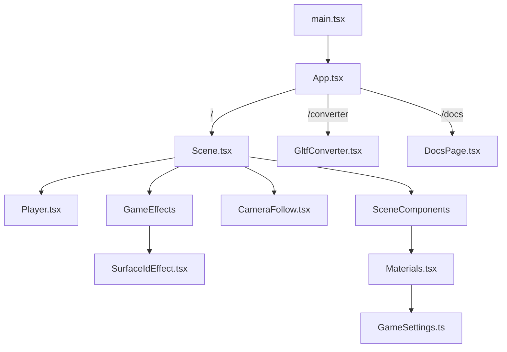

# IKEA Game — Projektdokumentation

> **Tech:** Vite + React 19 + TypeScript (strict) + Three.js r182 + React Three Fiber 9 + Rapier Physics
> **Repo:** [IKEA-GAME-Prototype](https://github.com/petersimmalugnt/IKEA-GAME-Prototype)
> **Dev:** `npm run dev` → `http://localhost:5173` (spel) / `http://localhost:5173/converter` (konverterare) / `http://localhost:5173/docs` (dokumentation)

---

## Arkitekturöversikt



| Fil | Ansvar |
|-----|--------|
| `App.tsx` | Routing (`/` = spel, `/converter` = C4D-konverterare, `/docs` = dokumentation), Canvas-setup, kamera, ljus |
| `GameSettings.ts` | **Centrala konfigurationen** — färger, material, kamera, fysik, debug |
| `Scene.tsx` | Spelscenen med Physics-wrapper, alla element, keyboard controls |
| `Player.tsx` | Spelarbol med physics, keyboard input, hopp (raycast) |
| `SceneComponents.tsx` | Återanvändbara element: Cube, Sphere, Cylinder, Spline, InvisibleFloor, C4DMesh |
| `Materials.tsx` | Custom toon shader (GLSL), material-cache, C4DMaterial-komponent |
| `Lights.tsx` | DirectionalLight med shadow-konfiguration |
| `CameraFollow.tsx` | Isometrisk kamera som följer spelaren med lerp + skugg-target |
| `Effects.tsx` | Post-processing pipeline (EffectComposer + SMAA) |
| `SurfaceIdEffect.tsx` | Custom outline-effekt: surface-ID + normal-baserade kanter |
| `GltfConverter.tsx` | FBX/GLB → TSX-konverterare (drag & drop) |
| `DocsPage.tsx` | Visar `DOCS.md` i browser med sidebar + Mermaid-diagram |
| `PhysicsStepper.ts` | Manuell physics-stepping (oanvänd för tillfället) |

---

## GameSettings.ts — Central konfiguration

All visuell och gameplay-konfiguration samlas i `SETTINGS`-objektet:

### Färgpalett (Toon Material)
```js
palette: {
  one:   { base: '#45253A', mid: '#3C1F33' },  // Mörklila (default)
  two:   { base: '#558DCE', mid: '#4781C6' },  // Blå
  three: { base: '#D9B5A3', mid: '#B38F7D' },  // Beige/hud
  four:  { base: '#665747', mid: '#59443A' },  // Brun
  five:  { base: '#FF2D19', mid: '#E52233' },  // Röd
}
```

### Viktiga inställningar
| Sektion | Nyckelparametrar |
|---------|-----------------|
| `debug` | `enabled`, `showColliders`, `showStats` |
| `colors` | `background`, `shadow`, `outline` |
| `lines` | `enabled`, `thickness`, `creaseAngle` |
| `camera` | `zoom` (300), `position` ([5,5,5]), `followLerp` |
| `light` | `position`, `shadowMapSize` (4096), `shadowBias` |
| `material` | `highlightStep` (0.6), `midtoneStep` (0.1) |
| `player` | `impulseStrength`, `jumpStrength`, `linearDamping`, `mass` |

---

## Rendering Pipeline

### 1. Toon Shader (`Materials.tsx`)

Custom GLSL shader med tre zoner:
- **Highlight** (NdotL × shadow > 0.6) → `base` color
- **Midtone** (> 0.1) → `mid` color
- **Shadow** (resten) → `shadow` color från `SETTINGS.colors.shadow`

Material cachas per unik färgkombination. Alla meshes med samma palette-token delar samma material-instans.

### 2. Outline Effect (`SurfaceIdEffect.tsx`)

Post-processing effekt med **två render-passes per frame:**
1. **Surface ID pass** — Varje mesh med `userData.surfaceId` renderas med en unik färg
2. **Normal pass** — Samma meshes renderas med `MeshNormalMaterial`

Fragment-shadern jämför 8 grann-pixlar för att hitta:
- **ID-kanter** — där surface-ID ändras (konturlinjer)
- **Normal-kanter** — där normalvinkeln överstiger `creaseAngle` (inre linjer)

> **OBS:** Objekt med `userData.excludeFromOutlines = true` (t.ex. splines) hoppas över.

### 3. C4DMesh

Wrapper runt `<mesh>` som auto-genererar ett unikt `surfaceId` för outline-detektionen:
```jsx
<C4DMesh geometry={...} castShadow receiveShadow>
  <C4DMaterial color="two" />
</C4DMesh>
```

---

## Fysiksystem (Rapier)

### SceneComponents

| Komponent | Collider-typ | Noteringar |
|-----------|-------------|------------|
| `CubeElement` | `CuboidCollider` | Automatisk halvstorlek |
| `SphereElement` | `BallCollider` | Radie-baserad |
| `CylinderElement` | `ConvexHullCollider` | Genererar top/bottom rings med N sidor |
| `SplineElement` | Flera `CuboidCollider` | Ett per segment, orienterat längs kurvan |
| `InvisibleFloor` | `CuboidCollider` | Fast golv med skugg-plan |

### Physics-props (alla element)
```jsx
<CubeElement
  physics="dynamic"     // "dynamic" | "fixed" | "kinematicPosition"
  mass={0.3}
  friction={3}
  lockRotations={true}
  position={[0, 0.5, 0]}
  rotation={[-61, 0, 0]}  // I GRADER (konverteras internt)
/>
```

### Spelaren (`Player.tsx`)
- `RigidBody` med `BallCollider` (r=0.1)
- Densitet beräknas från `SETTINGS.player.mass`
- Impulse-baserad rörelse (WASD/piltangenter)
- **Hopp** via raycast nedåt (0.05 max avstånd)
- CCD aktivt (förhindrar tunneling)

---

## Kamerasystem

**Ortografisk** isometrisk kamera med:
- Position-offset `[5, 5, 5]` relativt spelaren
- **Delta-oberoende lerp:** `1 - Math.pow(1 - followLerp, delta × 60)`
- Skuggor flyttas med spelaren (DirectionalLight + target)
- Första framen snappar direkt (inget lerp-glid vid start)

---

## SplineElement

Renderar kurviga linjer med konstant pixelbredd:

```jsx
<SplineElement
  points={[[-1, 0.2, -0.5], [0.5, 0.15, 0.3], [1.3, 0.4, -0.2]]}
  segments={40}
  closed={false}
  curveType="catmullrom"
  tension={0.5}
  physics="dynamic"
  friction={1}
/>
```

- Använder `Line2` + `LineMaterial` (screen-space bredd)
- `worldUnits: false` → konstant pixelbredd oavsett zoom
- `excludeFromOutlines: true` → ignoreras av outline-effekten
- Med `physics`: genererar `CuboidCollider` per segment, orienterade längs kurvan

---

## C4D → R3F Konverterare

**URL:** `http://localhost:5173/converter`

### Pipeline
```
FBX/GLB fil → Drag & Drop → Parser → GLB + JSX output → Spara till projekt
```

### Stödda filformat
- `.glb` / `.gltf` — direkt parsing
- `.fbx` — konverteras till GLB via `FBXLoader` + `GLTFExporter`

### Namngivnings-tokens (i C4D)

Tokens sätts i **objektnamnet** i Cinema 4D:

| Token | Funktion | Exempel |
|-------|----------|---------|
| `_colorX` | Sätter färg från paletten | `Cube_colorTwo` → `colors.two` |
| `_singletone` | Tvingar enhetlig ton (ingen mid) | `Box_colorFive_singletone` |
| `_dynamic` | Dynamisk fysikkropp | `Group_dynamic` |
| `_fixed` / `_static` | Fast fysikkropp | `Floor_fixed` |
| `_kinematic` | Kinematisk kropp | `Platform_kinematic` |
| `_massX` | Sätter massa | `Cube_dynamic_mass0.5` |
| `_fricX` | Sätter friktion | `Ramp_dynamic_fric3` |
| `_lockRot` | Låser rotation | `Block_dynamic_lockRot` |
| `_sensor` | Sensor (trigger, ej solid) | `Zone_dynamic_sensor` |
| `_collider` | Markerar geo som kollisions-proxy | `Box_collider` |

### Kollisions-hantering

- Barn med `_collider` i namnet → `ConvexHullCollider` (ej synlig)
- Position/rotation från collider-geon bevaras
- `colliders={false}` sätts automatiskt på `RigidBody` (förhindrar auto-colliders)
- **Viktigt:** Collider-geon och synlig geo ska vara i samma grupp

### Färg-arv
Färg-tokens ärvs nedåt i hierarkin. Om en grupp har `_colorTwo`, får alla barn den färgen om de inte har en egen token.

### Splines (FBX)
- NurbsCurve/Spline-objekt detekteras automatiskt som `THREE.Line`
- Extraheras till `SplineElement` med punktdata
- `closed`-attributet sätts automatiskt

### Animationer (FBX)
Genererar `useAnimations` hook med crossfade-logik:
```jsx
// Tillgängliga animationer: "Anim1", "Anim2"
<SplineAndAnimTest animation="Anim1" fadeDuration={0.3} />
```
- `animation={null}` → rest position
- `CINEMA_4D_Main` filtreras bort automatiskt
- Crossfade: gamla animationer fadar ut, ny fadar in
- Konverteraren sätter nu `name={nodes['...'].name}` på genererade `C4DMesh` och grupper så att Three.js track-binding fungerar (`THREE.PropertyBinding` kräver nodnamn som matchar animationstracks).
- Om animationer inte spelar: kontrollera först browser-console för `No target node found for track` (betyder oftast att nodnamn saknas/mismatchar).

### Spara till projekt
Knappen "SAVE TO PROJECT" sparar:
- `.glb` — konverterat modell-fil
- `.tsx` — genererad React-komponent

Filer sparas via **File System Access API** (kräver användarens permission).

---

## Browser Testning & Console

### Öppna appen i browser
```bash
npm run dev
# öppna sedan:
# http://127.0.0.1:5173/
```

### Läs browser-console automatiskt (headless Chrome)
```bash
npm run console:check
```

Valfri URL:
```bash
npm run console:check -- http://127.0.0.1:5173/docs
```

Miljövariabler:
- `CDP_PORT` (default `9222`)
- `CONSOLE_LISTEN_MS` (default `5000`)

### TypeScript-check
```bash
npm run typecheck
```

### TS-migrering (status)
- Hela `src/` är migrerat till `.ts`/`.tsx`.
- `tsconfig.json` kör strict-läge (`strict: true`) och `allowJs: false`.
- Konverteraren genererar `.tsx` i `src/assets/models/`.

---

## Projektstruktur

```
src/
├── App.tsx                 # Routing & Canvas
├── main.tsx                # React entry point
├── GameSettings.ts         # Central konfiguration
├── Scene.tsx               # Spelscen
├── Player.tsx              # Spelarlogik
├── SceneComponents.tsx     # Cube, Sphere, Cylinder, Spline, C4DMesh, InvisibleFloor
├── Materials.tsx           # Toon shader & C4DMaterial
├── Lights.tsx              # Ljus & skuggor
├── CameraFollow.tsx        # Isometrisk kamera-follow
├── Effects.tsx             # Post-processing wrapper
├── SurfaceIdEffect.tsx     # Custom outline-effekt
├── PhysicsStepper.ts       # Manuell physics step (oanvänd)
├── GltfConverter.tsx       # FBX/GLB → TSX konverterare
├── DocsPage.tsx            # Browser-renderad dokumentation
├── DocsPage.css            # Stil för docs-sidan
└── assets/
    ├── models/             # Genererade GLB + TSX filer
    └── splineAndAnimTest.glb
```

---

*Senast uppdaterad: 2026-02-16*
