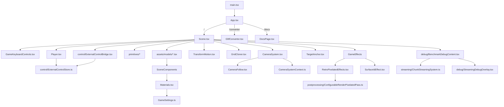

# IKEA Game — Projektdokumentation

> **Tech:** Vite + React 19 + TypeScript (strict) + Three.js r182 + React Three Fiber 9 + Rapier Physics + Culori (OKLCH)
> **Repo:** [IKEA-GAME-Prototype](https://github.com/simmalugnt-se/IKEA-GAME-Prototype)
> **Dev:** `npm run dev` → `http://localhost:5173` (spel) / `http://localhost:5173/converter` (konverterare) / `http://localhost:5173/docs` (dokumentation)

---

## Arkitekturöversikt



| Fil | Ansvar |
|-----|--------|
| `App.tsx` | Routing (`/` = spel, `/converter` = C4D-konverterare, `/docs` = dokumentation), Canvas-setup, kamera, ljus |
| `GameSettings.ts` | **Centrala konfigurationen** — färger, material, kamera, fysik, debug |
| `GameSettings.types.ts` | Delade typer för settings och core-konfig (`Settings`, `Vec3`, palette/control/camera-typer) |
| `Scene.tsx` | Spelscenens komposition: physics-wrapper, nivåinnehåll och koppling av delsystem |
| `TransformMotion.tsx` | Centralt motion-system + wrapper (`TransformMotion`) för linjär rörelse av position/rotation/scale (auto-loop när `positionRange` finns) |
| `GridCloner.tsx` | Grid-baserad cloner för att duplicera valfria scenelement med valfri cloner-fysik |
| `GameKeyboardControls.tsx` | Input-wrapper med gemensam keymap för spelkontroller |
| `Player.tsx` | Spelarbol med physics/kinematik, input via keyboard/external pipeline, hopp (raycast i digitalt läge) |
| `PositionTargetHandle.ts` | Delad ref-handle-typ (`getPosition`) för player/primitives |
| `control/ExternalControlBridge.tsx` | Adapterlager för extern styrdata (window API, custom events, valfri WebSocket-klient) |
| `control/ExternalControlStore.ts` | Transport-oberoende in-memory store för digital/absolute kontrollframes |
| `primitives/*` | Primitive-komponenter (`CubeElement`, `SphereElement`, `CylinderElement`, `BlockElement`, `InvisibleFloor`) + gemensam physics-wrapper + align-hjälpare |
| `SceneComponents.tsx` | Shared scene-byggstenar för konverterade modeller (`C4DMesh`, `C4DMaterial`, `SplineElement`) |
| `CameraSystem.tsx` | Kapslar target-registry + kamera + streaming-center, kopplas in via provider i `Scene` |
| `CameraSystemContext.ts` | Delad context/hook för target-registry och streaming-center |
| `TargetAnchor.tsx` | Enkel wrapper för att ge valfritt scenelement ett `targetId` som kamera/streaming kan följa |
| `streaming/ChunkStreamingSystem.ts` | Kärnlogik för chunk-aktivering (preload/render/physics) |
| `debug/BenchmarkDebugContent.tsx` | Debug/benchmark-objekt som använder streamingsystemet |
| `debug/StreamingDebugOverlay.tsx` | Visuell streaming-debug (ringar och chunk-bounds) |
| `Materials.tsx` | Custom toon shader (GLSL), material-cache, C4DMaterial-komponent |
| `Lights.tsx` | DirectionalLight med shadow-konfiguration |
| `CameraFollow.tsx` | Kamerariggen (follow/static), target-resolve, axellåsning, rotationslåsning och ljus-follow |
| `Effects.tsx` | Render-lägesväxel (`toon`, `pixel`, `retroPixelPass`) och postprocess-orkestrering |
| `RetroPixelatedEffects.tsx` | Egen three.js composer-kedja för retro-läget (pixelpass + outputpass) |
| `postprocessing/ConfigurableRenderPixelatedPass.ts` | Anpassad pixelpass med styrbar depth-edge-threshold |
| `SurfaceIdEffect.tsx` | Custom outline-effekt: surface-ID + normal-baserade kanter |
| `GltfConverter.tsx` | FBX/GLB → TSX-konverterare (drag & drop) |
| `DocsPage.tsx` | Visar `DOCS.md` i browser med sidebar + Mermaid-diagram |
| `PhysicsStepper.ts` | Manuell physics-stepping (oanvänd för tillfället) |

---

## GameSettings.ts — Central konfiguration

All visuell och gameplay-konfiguration samlas i `SETTINGS`-objektet:

### Färgpalett (Toon Material)
```ts
palette: {
  active: 'green', // globalt palettbyte
  variants: {
    classic: { background: '#3D2C23', colors: [{ base: '#45253A' }, { base: '#558DCE' }, ...] },
    greyscale: { background: '#1b1b1b', colors: [{ base: '#717171' }, { base: '#424242' }, ...] },
    green: { background: '#0E3420', colors: [{ base: '#669E10' }, { base: '#006B18' }, ...] },
  },
  autoMid: {
    enabled: true,
    lightnessDelta: -0.06,
    chromaDelta: -0.005,
    hueShift: 5,
  },
}
```

- `base` krävs per färgentry i `colors`-arrayen (index `0..N`).
- `mid` är valfri per entry. Om `mid` saknas auto-genereras den från `base` med OKLCH-reglagen i `autoMid`.
- `background` ligger per variant och används för aktiv scen-/canvasbakgrund.
- `active` byter hela paletten globalt utan att röra modellfiler.
- Modellprops använder numeriska index: `materialColor0={3}`.
- Index normaliseras med modulo mot aktiv palettlängd (ex: `12` i en 10-färgspalett blir index `2`).

### Viktiga inställningar
| Sektion | Nyckelparametrar |
|---------|-----------------|
| `render` | `style: 'toon' | 'pixel' | 'retroPixelPass'` |
| `controls` | `inputSource`, `external(mode, staleTimeoutMs, absolute, websocket)` |
| `debug` | `enabled`, `showColliders`, `showStats`, `benchmark`, `streaming` |
| `streaming` | `enabled`, `cellSize`, `preload/render/physics`-radier, `updateIntervalMs`, `center(source,targetId)` |
| `colors` | `shadow`, `outline` |
| `palette` | `active`, `variants`, `autoMid(lightnessDelta/chromaDelta/hueShift)` |
| `lines` | `enabled`, `thickness`, `creaseAngle`, `threshold`, `composerMultisampling`, `smaaEnabled`, `smaaPreset` |
| `pixelation` | `enabled`, `granularity` (används i `render.style = 'pixel'`) |
| `retroPixelPass` | `pixelSize`, `normalEdgeStrength`, `depthEdgeStrength`, `depthEdgeThresholdMin/Max` |
| `camera` | `mode`, `base`, `static(position/lookAt)`, `follow(targetId, offset, lerp, axis/rotation lock)` |
| `light` | `position`, `shadowMapSize` (4096), `shadowBias` |
| `material` | `highlightStep` (0.6), `midtoneStep` (0.1), `castMidtoneStep` (0.2), `castShadowStep` (0.6) |
| `player` | `impulseStrength`, `jumpStrength`, `linearDamping`, `mass` |

### IntelliSense för fasta val

Fasta val i settings och komponentprops är nu centraliserade som union-typer/konstanter för bättre IntelliSense:

- `src/GameSettings.types.ts` exporterar options-konstanter för t.ex. `render.style`, `camera.mode`, `lines.smaaPreset`, input-källor och externa kontrollägen.
- `src/physics/physicsTypes.ts` exporterar explicita physics-mode-listor (`fixed`, `dynamic`, `kinematicPosition`, `kinematicVelocity`, `noneToDynamicOnCollision`, `solidNoneToDynamicOnCollision`, `animNoneToDynamicOnCollision`).
- `src/GridCloner.tsx`, `src/TransformMotion.tsx`, `src/SceneComponents.tsx` och `src/primitives/BlockElement.tsx` använder explicita unions för props med fasta alternativ (t.ex. `loopMode`, `transformMode`, `curveType`, `plane`, presets).
- Konverterade modellkomponenter använder typed `animation`-props (literal union per modell) istället för fri `string`.

### Renderlägen (`SETTINGS.render.style`)

- `toon` — standardläget: `SurfaceIdEffect` + valfri SMAA.
- `pixel` — samma som `toon` men med extra `Pixelation`-pass i slutet.
- `retroPixelPass` — separat three.js composer-kedja med `ConfigurableRenderPixelatedPass` + `OutputPass`.

`retroPixelPass` använder egna parametrar i `SETTINGS.retroPixelPass`.

### Benchmark-läge (Debug)

För att stress-testa render + outlines på större scenmängd utan att bygga om banan manuellt finns auto-genererad benchmark i `SETTINGS.debug.benchmark`:

- `enabled` — aktiverar benchmark-objekt i scenen
- `gridX`, `gridZ`, `layers` — hur många objekt som genereras
- `spacing`, `heightStep`, `origin` — layout i världen
- `usePhysics`, `fixedColliderEvery` — valfri fixed physics på en del av benchmark-objekten

När `enabled: false` påverkas ordinarie bana inte.

### Streaming-läge (Automatisk chunk-aktivering)

`SETTINGS.streaming` styr automatiskt vilka benchmark/world-objekt som är aktiva utifrån vald center-källa:

- `cellSize` — chunkstorlek i world-units
- `preloadRadius` — markerar chunkar för preload-zon
- `renderLoadRadius` / `renderUnloadRadius` — visuell in/ut-laddning med hysteresis
- `physicsLoadRadius` / `physicsUnloadRadius` — fysik in/ut med hysteresis
- `updateIntervalMs` — hur ofta aktiveringsberäkning uppdateras
- `center.source` — `target` eller `cameraFocus`
- `center.targetId` — vilket target som används när `source = 'target'`

`SETTINGS.debug.streaming` ger visuell debug i scenen:

- Ringar runt aktiv streaming-center för preload/render/physics-radier
- Chunk-grid med färgkodning (preload/render/physics)

---

## Streaming-arkitektur (Core vs Debug)

Streaming är uppdelat så att debug/benchmark kan tas bort utan att röra kärnlogiken:

- `src/streaming/ChunkStreamingSystem.ts` — neutral kärna (chunk-state + aktiveringslogik)
- `src/debug/BenchmarkDebugContent.tsx` — auto-genererad benchmark-content för test
- `src/debug/StreamingDebugOverlay.tsx` — visuell debug-overlay
- `src/CameraSystem.tsx` levererar center-position till både kamera och streaming
- `src/Scene.tsx` kopplar in debugdelen via en enda komponent (`BenchmarkDebugContent`)

---

## Inputsystem

Input är uppdelat i keyboard + extern pipeline:

- `src/GameKeyboardControls.tsx` innehåller `KeyboardControls` + keymap
- `src/control/ExternalControlStore.ts` är en transport-oberoende store för externa kontrollframes
- `src/control/ExternalControlBridge.tsx` kopplar in valfri WebSocket-klient + browser API
- `src/Player.tsx` läser och kombinerar input enligt `SETTINGS.controls`

`SETTINGS.controls.inputSource` styr källa:

- `keyboard` — endast keyboard
- `external` — endast extern data
- `hybrid` — keyboard + extern digital data (OR per knapp)

`SETTINGS.controls.external.mode` styr extern typ:

- `digital` — triggerdata (`forward/backward/left/right/jump`)
- `absolute` — absolut target-position (`x/z`) med kort smoothing + hastighetsclamp

I `absolute`-läge kör spelaren `kinematicPosition` (inte dynamic) för stabil positionering men med aktiv collider.

### Extern API (browser)

Bridge exponerar ett enkelt globalt API:

```js
window.__IKEA_GAME_CONTROL__.send({
  mode: 'digital',
  forward: true,
  jump: false,
  seq: 101,
  timestamp: Date.now(),
})
```

Eller via custom event:

```js
window.dispatchEvent(new CustomEvent('ikea-game-control', {
  detail: { mode: 'absolute', x: 1.25, z: -0.8, seq: 202, timestamp: Date.now() }
}))
```

Valfri inbyggd WebSocket-klient aktiveras via:

- `SETTINGS.controls.external.websocket.enabled`
- `SETTINGS.controls.external.websocket.url`

---

## Rendering Pipeline

### Renderlägen (`Effects.tsx`)

- `toon`:
1. `SurfaceIdEffect` (outlines/creases)
2. Valfri `SMAA`

- `pixel`:
1. `SurfaceIdEffect`
2. Valfri `SMAA`
3. `Pixelation`

- `retroPixelPass`:
1. `ConfigurableRenderPixelatedPass` (low-res render + normal/depth edge)
2. `OutputPass` (tone mapping + color space conversion)

I `retroPixelPass` används inte `SurfaceIdEffect`/`SMAA`, utan en separat three.js composer-kedja i `RetroPixelatedEffects.tsx`.

### 1. Toon Shader (`Materials.tsx`)

Custom GLSL shader med tre zoner:
- **Direct Highlight** (`NdotL > highlightStep`) → `base` color
- **Direct Midtone** (`NdotL > midtoneStep`) → `mid` color
- **Cast Shadow Bands** styrs separat via `castMidtoneStep` och `castShadowStep` (från `getShadowMask`), och kan bara mörka ner resultatet
- **Shadow** (resten) → `shadow` color från `SETTINGS.colors.shadow`

Material cachas per unik färgkombination. Alla meshes med samma palette-token delar samma material-instans.

### 2. Outline Effect (`SurfaceIdEffect.tsx`)

Post-processing effekt med **två render-passes per frame:**
1. **Surface ID pass** — Varje mesh med `userData.surfaceId` renderas med en unik färg
2. **Normal pass** — Samma meshes renderas med `MeshNormalMaterial`

Fragment-shadern jämför 8 grann-pixlar för att hitta:
- **ID-kanter** — där surface-ID ändras (konturlinjer)
- **Normal-kanter** — där normalvinkeln överstiger `creaseAngle` (inre linjer), men bara inom samma surface-ID

ID-känslighet styrs av `SETTINGS.lines.threshold`.

Postprocess-AA styrs i `Effects.tsx` via:
- `SETTINGS.lines.composerMultisampling` (MSAA i composer)
- `SETTINGS.lines.smaaEnabled` + `SETTINGS.lines.smaaPreset`

> **OBS:** Objekt med `userData.excludeFromOutlines = true` (t.ex. splines) hoppas över.

### 2b. Retro Pixel Pass (`ConfigurableRenderPixelatedPass.ts`)

Bygger på three.js `RenderPixelatedPass` men med extra uniforms för depth-trösklar:

- `depthEdgeThresholdMin`
- `depthEdgeThresholdMax`

Det gör depth-edge användbar även i ortografiskt läge där standardtröskeln ofta är för hög.

### 3. C4DMesh

Wrapper runt `<mesh>` som auto-genererar ett unikt `surfaceId` för outline-detektionen:
```jsx
<C4DMesh geometry={...} castShadow receiveShadow>
  <C4DMaterial color="two" />
</C4DMesh>
```

---

## Fysiksystem (Rapier)

### Primitives (`src/primitives/*`)

| Komponent | Collider-typ | Noteringar |
|-----------|-------------|------------|
| `CubeElement` | `CuboidCollider` | Automatisk halvstorlek |
| `SphereElement` | `BallCollider` | Radie-baserad |
| `CylinderElement` | `ConvexHullCollider` | Genererar top/bottom rings med N sidor |
| `BlockElement` | `CuboidCollider` (via `CubeElement`) | Modulära storlekspresets + `plane` (`x | y | z`) |
| `InvisibleFloor` | `CuboidCollider` | Fast golv med skugg-plan |

### SceneComponents (`src/SceneComponents.tsx`)

| Komponent | Collider-typ | Noteringar |
|-----------|-------------|------------|
| `SplineElement` | Flera `CuboidCollider` | Ett per segment, orienterat längs kurvan |
| `C4DMesh` | - | Genererar unikt `surfaceId` per mesh för outline-pass |
| `C4DMaterial` | - | Re-export av material-komponenten från `Materials.tsx` |

### Physics-props (alla element)
```jsx
<CubeElement
  physics="dynamic"     // "dynamic" | "fixed" | "kinematicPosition" | "kinematicVelocity" | "noneToDynamicOnCollision" | "solidNoneToDynamicOnCollision" | "animNoneToDynamicOnCollision"
  mass={0.3}
  friction={3}
  lockRotations={true}
  position={[0, 0.5, 0]}
  rotation={[-61, 0, 0]}  // I GRADER (konverteras internt)
/>
```

`CubeElement`, `SphereElement`, `CylinderElement` och `BlockElement` stödjer `hidden={true}`:
- Döljer den visuella meshen
- Behåller collider/physics när `physics` är aktiv

### Align + Target refs (primitives)

- `align` används på primitives (`CubeElement`, `SphereElement`, `CylinderElement`, `BlockElement`) för pivot/offset i procent per axel (`0..100`, default `50`).
- `anchor` används inte längre.
- `BlockElement` default-alignar alltid mot botten (`y: 0`) om inget eget `align` skickas.
- `BlockElement.plane` styr vilken axel som behandlas som "höjd"-axel:
  - `y` (default): standard [x, y, z]
  - `x`: x/y byter plats
  - `z`: y/z byter plats
- `sizePreset`: `lg | md | sm | xs | xxs`
- `heightPreset`: `sm | md | lg`

Alla dessa komponenter exponerar samma ref-handle som `Player` via `PositionTargetHandle`:

```tsx
const targetRef = useRef<PositionTargetHandle | null>(null)

<BlockElement
  ref={targetRef}
  sizePreset="md"
  heightPreset="lg"
  plane="z"
/>
```

`targetRef.current?.getPosition()` returnerar world-position och kan användas för kamera-/streamingtargets.

### Spelaren (`Player.tsx`)
- `RigidBody` med `BallCollider` (r=0.1)
- Densitet beräknas från `SETTINGS.player.mass`
- Digitalt läge: impulse-baserad rörelse (keyboard och/eller extern triggerdata)
- Digitalt läge: **hopp** via raycast nedåt (0.05 max avstånd)
- Absolut läge: `kinematicPosition` + `setNextKinematicTranslation` (x/z) med smoothing/clamps från `SETTINGS.controls.external.absolute`
- CCD aktivt (förhindrar tunneling)

---

## Kamerasystem

Kameran är uppdelad i tre delar:

- `CameraSystemProvider` registrerar targets (`targetId`) och exponerar streaming-center
- `TargetAnchor` gör det enkelt att sätta `targetId` på valfritt scenelement
- `CameraFollow` kör själva kamerariggen (trots namnet hanterar den både `follow` och `static`)

`TargetAnchor` är valfri: i nuvarande `Scene.tsx` följs standard-target `player`, och `TargetAnchor` används bara när du vill registrera andra scenelement som möjliga camera/streaming-targets.

Viktiga features:

- **Mode:** `camera.mode = 'follow' | 'static'`
- **Follow target:** `camera.follow.targetId` (t.ex. `player`, `vault_stairs`)
- **Axellåsning:** `followAxes` och `lookAtAxes` (t.ex. lås höjd med `y: false`)
- **Rotationslåsning:** `lockRotation: true` för stabil ortografisk/isometrisk känsla (ingen wobble)
- **Delta-oberoende lerp:** `1 - Math.pow(1 - lerp, delta × 60)`
- **Light follow:** `moveLightWithTarget` för directional light + shadow target

---

## SplineElement

Renderar kurviga linjer med konstant pixelbredd:

```jsx
<SplineElement
  points={[[-1, 0.2, -0.5], [0.5, 0.15, 0.3], [1.3, 0.4, -0.2]]}
  segments={40}
  closed={false}
  curveType="catmullrom"
  tension={0.5}
  physics="dynamic"
  friction={1}
/>
```

- Använder `Line2` + `LineMaterial` (screen-space bredd)
- `worldUnits: false` → konstant pixelbredd oavsett zoom
- `excludeFromOutlines: true` → ignoreras av outline-effekten
- Kastar skuggor via en intern shadow-proxy (`InstancedMesh` med osynliga box-segment per spline-segment)
- `castShadow={false}` stänger av spline-shadow-proxy lokalt
- Med `physics`: genererar `CuboidCollider` per segment, orienterade längs kurvan
- Line2-resolution synkas nu explicit mot canvas-storlek för stabilare linjer vid browser-resize

---

## TransformMotion

`TransformMotion.tsx` introducerar ett lätt motionsystem för scenobjekt:

- `MotionSystemProvider` kör en central `useFrame`-uppdatering för alla registrerade motion-wrappers.
- `TransformMotion` används som wrapper runt valfri modell/mesh i `Scene.tsx`.
- Stöd i steg 1:
  - Linjär hastighet per axel (`positionVelocity`, `rotationVelocity`, `scaleVelocity`)
  - `loopMode`: `none` | `loop` | `pingpong`
  - Per-axel range för loop/pingpong (`positionRange`, `rotationRange`, `scaleRange`)
- Default-beteende:
  - Om `loopMode` utelämnas och `positionRange` är satt, används `loop`.
  - Om `loopMode` utelämnas och ingen `positionRange` finns, används `none`.
  - Explicit `loopMode` vinner alltid.
- Viktigt: range tolkas i wrapperns lokala transform-rum (dvs oftast som offset runt wrapperns startvärde).

Exempel:

```tsx
<TransformMotion
  positionVelocity={{ z: 0.2 }}
  positionRange={{ z: [-4.8, -3.2] }}
  loopMode="pingpong"
>
  <BallBalloon position={[0, 0.5, -4]} animation="moving" />
</TransformMotion>
```

Detta håller modellkomponenterna "dumma" (render-only), men ger enkel authoring i scenen med central uppdatering för bättre skalning.

---

## GridCloner

`GridCloner.tsx` är en ny wrapper för C4D-lik grid-distribution av valfria barn.

- Duplicerar `children` i ett 3D-grid via:
  - `count={[x, y, z]}`
  - `spacing={[x, y, z]}`
  - `offset={[x, y, z]}`
  - `position`, `rotation`, `scale` på själva clonern
  - `gridUnit` (optional): skalar positionsrelaterade värden med blocksteg
    - presets: `lg=0.2`, `md=0.1`, `sm=0.05`, `xs=0.025`
    - kan även vara ett eget tal (meter per "1")
  - `centered`:
    - `true`: griden centreras runt `position`
    - `false`: griden startar i `position` (hörn/startpunkt)
- `transformMode`:
  - `cloner` (default): barnets top-level transform nollställs och cloner styr transform
  - `child`: barnens transform behålls
- Enkel linjär index-offset via `stepOffset` (adderas per klonindex).
- Ordered effectors kan skrivas som children via:
  - `<LinearFieldEffector />` (C4D-lik linear field)
    - Direction/falloff: `axis`, `center`, `size`, `invert`
    - Remap/contour: `enableRemap`, `innerOffset`, `remapMin`, `remapMax`, `clampMin`, `clampMax`, `contourMode`, `contourSteps`, `contourMultiplier`, `contourCurve`
      - `contourMode` kan vara både klassiska lägen (`none`, `quadratic`, `step`, `quantize`, `curve`) och easing-namn (`easeInOutExpo`, `easeOutBounce`, osv)
    - Applicering: `position`, `rotation`, `scale`, `hidden`, `color`, `materialColors`
  - `<RandomEffector />` (deterministisk jitter via seed)
  - `<NoiseEffector />` (spatialt sammanhängande 3D-noise)
  - `<TimeEffector />` (tidsdriven modulation med `loopMode`, `duration`, `speed`, `timeOffset`, `cloneOffset`)
    - `easing` använder gemensam easings.net-katalog (`linear`, `easeInSine`, `easeOutSine`, `easeInOutSine`, `easeInQuad` ... `easeInOutBounce`)
    - Legacy-alias finns kvar: `smooth`, `easeIn`, `easeOut`, `easeInOut`
  - Körs i child-ordning och appliceras relativt (position/rotation/scale/hidden/färg)
  - Positionsrelaterade effector-värden (t.ex. `position`, plane `center/size`, noise `offset`) skalas också av `gridUnit`
- Legacy: `effectors`-prop fungerar fortfarande.
- Barnens egen `physics`-prop stripas automatiskt när clonern har fysik aktiv.
- `GridCloner.rotation` och alla effector-`rotation` värden anges i **grader** (konverteras internt till radianer).
- Valfri cloner-fysik per klon:
  - enkel syntax som primitives: `physics="fixed|dynamic|kinematicPosition|kinematicVelocity|noneToDynamicOnCollision|solidNoneToDynamicOnCollision|animNoneToDynamicOnCollision"` + `mass`, `friction`, `lockRotations`
  - default om du sätter `physics`: Rapier auto-collider från clone-meshen (ingen manuell collider krävs)
  - undantag: `noneToDynamicOnCollision`, `solidNoneToDynamicOnCollision` och `TimeEffector` med `scale` använder infererad manuell collider
  - `noneToDynamicOnCollision`: bodyless arming när explicit collider finns (ingen rigidbody före första trigger) och collidern ligger kvar i pre-collision-läge för bästa prestanda
  - `solidNoneToDynamicOnCollision`: bodyless arming med solid pre-collision collider (ingen rigidbody före första trigger), sedan `dynamic` vid första kollision
  - `animNoneToDynamicOnCollision`: pre-collision är solid (fixed) och följer animation visuellt; vid första kollision byter kroppen till `dynamic`
  - om en aktiv `<TimeEffector />` animerar `scale` byter clonern automatiskt till infererad manuell collider (från första barnet) så collider-shape kan synkas korrekt över tid
  - för exakt kontroll kan du override:a med `collider` + `colliderOffset`
  - collider-former: `cuboid` (`halfExtents`), `ball` (`radius`), `cylinder` (`halfHeight`, `radius`), `auto`
  - `collider: { shape: 'auto' }` försöker inferera collider från första barnet (`CubeElement`, `SphereElement`, `CylinderElement`, `BlockElement`) inkl. align-offset
- Känd begränsning: vid `TimeEffector` med animerad `scale` + alignade children kan collider-geo avvika från visuell align (särskilt vid icke-centrerad align). Använd explicit `collider`/`colliderOffset` om du behöver exakt match i dessa fall.
- `showDebugEffectors` (default följer `SETTINGS.debug.enabled`) visar linear field med två plan + riktning (linje/pil) i scenen.

Exempel:

```tsx
<GridCloner
  count={[6, 1, 4]}
  gridUnit="lg"
  spacing={[4, 0, 4]}
  position={[3, 0, 0]}
  centered
  transformMode="cloner"
  stepOffset={[0, 0.02, 0]}
  physics="dynamic"
  mass={0.2}
  friction={0.8}
>
  <LinearFieldEffector
    axis="x"
    center={0}
    size={6}
    enableRemap
    contourMode="curve"
    contourCurve={[[0, 0], [0.35, 0.15], [0.7, 0.7], [1, 1]]}
    position={[0, 1, 0]}
  />
  <RandomEffector seed={12} strength={0.6} rotation={[0, 0.35, 0]} scale={[0.15, 0.15, 0.15]} />
  <NoiseEffector
    seed={42}
    strength={0.7}
    frequency={[0.8, 0.8, 0.8]}
    position={[0.25, 0.1, 0.25]}
    rotation={[0, 0.2, 0]}
    scale={[0.1, 0.1, 0.1]}
  />
  <TimeEffector
    loopMode="pingpong"
    duration={2}
    cloneOffset={0.08}
    easing="smooth"
    position={[0, 0.2, 0]}
  />
  <BlockElement sizePreset="sm" heightPreset="md" color={2} />
</GridCloner>
```

Notering:
- v1 renderar separata kloner (ej GPU-instancing), vilket bevarar nuvarande outline-beteende och minskar risk för linje-artifacts.

---

## C4D → R3F Konverterare

**URL:** `http://localhost:5173/converter`

### Pipeline
```
FBX/GLB fil → Drag & Drop → Parser → GLB + JSX output → Spara till projekt
```

### Stödda filformat
- `.glb` / `.gltf` — direkt parsing
- `.fbx` — konverteras till GLB via `FBXLoader` + `GLTFExporter`

### Namngivnings-tokens (i C4D)

Tokens sätts i **objektnamnet** i Cinema 4D:

| Token | Funktion | Exempel |
|-------|----------|---------|
| `_colorX` | Sätter färgindex från paletten (`X` är heltal, börjar på `0`) | `Cube_color3` → `materialColor0={3}` (slot-baserad prop) |
| `_singletone` | Tvingar enhetlig ton (ingen mid) | `Box_color4_singletone` |
| `_hidden` / `_invisible` | Markerar objekt som visuellt dolt (renderas ej) men med bibehållen fysik/collider | `Proxy_hidden_dynamic` |
| `_dynamic` | Dynamisk fysikkropp | `Group_dynamic` |
| `_fixed` / `_static` | Fast fysikkropp | `Floor_fixed` |
| `_kinematic` | Kinematisk kropp | `Platform_kinematic` |
| `_noneToDynamic` / `_none_to_dynamic` | Bodyless arming (när explicit collider finns), byter till `dynamic` vid första intersection | `Wall_noneToDynamic` |
| `_solidNoneToDynamic` / `_solid_none_to_dynamic` | Bodyless arming med solid collider före aktivering, byter till `dynamic` vid första kollision | `Wall_solidNoneToDynamic` |
| `_animNoneToDynamic` / `_anim_none_to_dynamic` | Som ovan men för animerad pre-collision (solid/fixed innan aktivering), sedan `dynamic` | `Wall_animNoneToDynamic` |
| `_massX` | Sätter massa | `Cube_dynamic_mass0.5` |
| `_fricX` | Sätter friktion | `Ramp_dynamic_fric3` |
| `_lockRot` | Låser rotation | `Block_dynamic_lockRot` |
| `_sensor` | Sensor (trigger, ej solid) | `Zone_dynamic_sensor` |
| `_collider` | Markerar collider-geo (barn-proxy eller egen geo på samma objekt) | `Box_collider` |
| `_noshadow` / `_shadowoff` | Endast spline: stänger av spline-shadow-proxy (linjen syns men kastar ingen skugga) | `Curve_noshadow` |

### Kollisions-hantering

- Barn med `_collider` i namnet → `ConvexHullCollider` (ej synlig)
- Position/rotation från collider-geon bevaras
- `colliders={false}` sätts automatiskt på `RigidBody` när explicita colliders genereras
- Om physics-objektet självt har `_collider` och är en mesh, används dess egen geo som `ConvexHullCollider`
- Om physics-objektet självt har `_collider` men saknar egen geo (t.ex. grupp/null), skapas en omslutande `CuboidCollider` från barnens bounds
- Om inget `_collider` används på physics-objektet behålls Rapier auto-colliders (default-beteende)
- **Viktigt:** Redigera inte genererad TSX i `assets/models` manuellt; uppdatera konverteraren och kör ny FBX→GLB/TSX-konvertering

### Färg-arv
Färg-tokens ärvs nedåt i hierarkin. Om en grupp har `_color3`, får alla barn den färgen om de inte har en egen token.

### Genererade override-props
Konverteraren genererar nu slot-baserade props för återanvändning:

- Färger: `materialColor0`, `materialColor1`, `materialColor2` ...
- Synlighet: `materialHidden0`, `materialHidden1` ... (skapas bara när hidden-token används)
- Fysikprofiler: `rigidBodyOne`, `rigidBodyTwo`, `rigidBodyThree` ...

Färgslot-namnen är stabila per exporterad modell och separerade från själva färgindexet.
Exempel: om modellen bara använder token `_color7` blir default `materialColor0={7}`.

Fysikprofiler dedupliceras: objekt med identisk physics-config delar samma rigidBody-slot.
Det gör att en override på t.ex. `rigidBodyOne` slår på alla objekt som använder den profilen.

Exempel:
```tsx
<Stair
  materialColor0={4}
  rigidBodyOne={{ type: 'fixed', friction: 1.5 }}
/>
```

### Splines (FBX)
- NurbsCurve/Spline-objekt detekteras automatiskt som `THREE.Line`
- Extraheras till `SplineElement` med punktdata
- `closed`-attributet sätts automatiskt
- Spline placeras i samma parent-hierarki som i C4D (inte längre globalt i slutet av komponenten)
- Lokala spline-rotationer konverteras till grader i output (matchar `SplineElement`-API)

### Animationer (FBX)
Genererar `useAnimations` hook med crossfade-logik:
```jsx
// Tillgängliga animationer: "Anim1", "Anim2"
<SplineAndAnimTest animation="Anim1" fadeDuration={0.3} />
```
- `animation={null}` → rest position
- `CINEMA_4D_Main` filtreras bort automatiskt
- Crossfade: gamla animationer fadar ut, ny fadar in
- Konverteraren sätter nu `name={nodes['...'].name}` på genererade `C4DMesh` och grupper så att Three.js track-binding fungerar (`THREE.PropertyBinding` kräver nodnamn som matchar animationstracks).
- Om animationer inte spelar: kontrollera först browser-console för `No target node found for track` (betyder oftast att nodnamn saknas/mismatchar).

### Spara till projekt
Knappen "SAVE TO PROJECT" sparar:
- `.glb` — konverterat modell-fil
- `.tsx` — genererad React-komponent

Filer sparas via **File System Access API** (kräver användarens permission).

---

## Browser Testning & Console

### Öppna appen i browser
```bash
npm run dev
# öppna sedan:
# http://127.0.0.1:5173/
```

### Läs browser-console automatiskt (headless Chrome)
```bash
npm run console:check
```

Valfri URL:
```bash
npm run console:check -- http://127.0.0.1:5173/docs
```

Miljövariabler:
- `CDP_PORT` (default `9222`)
- `CONSOLE_LISTEN_MS` (default `5000`)

### TypeScript-check
```bash
npm run typecheck
```

### TS-migrering (status)
- Hela `src/` är migrerat till `.ts`/`.tsx`.
- `tsconfig.json` kör strict-läge (`strict: true`) och `allowJs: false`.
- Konverteraren genererar `.tsx` i `src/assets/models/`.

---

## Projektstruktur

```
src/
├── App.tsx                 # Routing & Canvas
├── main.tsx                # React entry point
├── GameSettings.ts         # Central konfiguration
├── GameSettings.types.ts   # Delade typer för settings/core config
├── GameKeyboardControls.tsx # Input-wrapper + keymap
├── Scene.tsx               # Spelscen
├── TransformMotion.tsx     # Centralt motionsystem + wrapper (linjär rörelse, loop/pingpong)
├── GridCloner.tsx          # Grid-cloner (count/spacing/offset + valfri cloner-fysik)
├── Player.tsx              # Spelarlogik
├── PositionTargetHandle.ts # Delad ref-handle-typ (getPosition)
├── control/
│   ├── ExternalControlBridge.tsx # Extern input-adapter (window API + optional WS)
│   └── ExternalControlStore.ts   # Transport-oberoende kontrollstore (digital/absolute)
├── primitives/
│   ├── PhysicsWrapper.tsx  # Gemensam physics/collider-wrapper för primitives
│   ├── CubeElement.tsx     # Cube primitive (hidden + optional physics)
│   ├── SphereElement.tsx   # Sphere primitive (hidden + optional physics)
│   ├── CylinderElement.tsx # Cylinder primitive (hidden + optional physics)
│   ├── BlockElement.tsx    # Modulär block-primitive (presets + plane + default bottom align)
│   ├── anchor.ts           # Align-hjälpare (percent -> offset)
│   └── InvisibleFloor.tsx  # Osynligt golv + shadow plane + fast collider
├── SceneComponents.tsx     # Shared components för konverterade modeller (C4DMesh, C4DMaterial, SplineElement)
├── SceneHelpers.ts         # Delade hjälpare (surfaceId-hash + grader→radianer)
├── CameraSystem.tsx        # Camera provider: target-registry + streaming-center
├── CameraSystemContext.ts  # Context/hook för camerasystemet
├── TargetAnchor.tsx        # Target-ID wrapper för scenelement
├── streaming/
│   └── ChunkStreamingSystem.ts   # Chunk-streaming core
├── debug/
│   ├── BenchmarkDebugContent.tsx # Benchmark-testcontent
│   └── StreamingDebugOverlay.tsx # Streaming debug-visualisering
├── Materials.tsx           # Toon shader & C4DMaterial
├── Lights.tsx              # Ljus & skuggor
├── CameraFollow.tsx        # Kamerarigg (follow/static, lock rotation/axes)
├── Effects.tsx             # Render-lägesväxel + postprocessing wrapper
├── RetroPixelatedEffects.tsx # Retro pixel-kedja (custom pass + output pass)
├── SurfaceIdEffect.tsx     # Custom outline-effekt
├── postprocessing/
│   └── ConfigurableRenderPixelatedPass.ts # Anpassad RenderPixelatedPass med depth-threshold settings
├── PhysicsStepper.ts       # Manuell physics step (oanvänd)
├── GltfConverter.tsx       # FBX/GLB → TSX konverterare
├── DocsPage.tsx            # Browser-renderad dokumentation
├── DocsPage.css            # Stil för docs-sidan
├── assets/
│   ├── models/             # Genererade GLB + TSX filer
│   └── splineAndAnimTest.glb
└── types/
    └── culori.d.ts         # Lokala typer för culori
```

---

*Senast uppdaterad: 2026-02-19*
