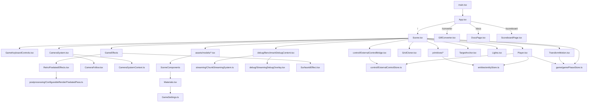

# IKEA Game — Projektdokumentation

> **Tech:** Vite + React 19 + TypeScript (strict) + Three.js r182 + React Three Fiber 9 + Rapier Physics + Culori (OKLCH)
> **Repo:** [IKEA-GAME-Prototype](https://github.com/simmalugnt-se/IKEA-GAME-Prototype)
> **Dev:** `npm run dev` → `http://localhost:5173` (spel) / `http://localhost:5173/converter` (konverterare) / `http://localhost:5173/docs` (dokumentation) / `http://localhost:5173/scoreboard` (scoreboard)

---

## Arkitekturöversikt


```mermaid
graph TD
    A[main.tsx] --> B[App.tsx]
    B -->|"/"| C[Scene.tsx]
    B -->|"/converter"| D[GltfConverter.tsx]
    B -->|"/docs"| L[DocsPage.tsx]
    B -->|"/scoreboard"| SB[ScoreboardPage.tsx]
    C --> M[GameKeyboardControls.tsx]
    C --> E[Player.tsx]
    C --> ECB[control/ExternalControlBridge.tsx]
    C --> PR[primitives/*]
    C --> AM[assets/models/*.tsx]
    AM --> F[SceneComponents]
    C --> TM[TransformMotion.tsx]
    C --> GC[GridCloner.tsx]
    C --> CS[CameraSystem.tsx]
    C --> TA[TargetAnchor.tsx]
    C --> LI[Lights.tsx]
    CS --> G[CameraFollow.tsx]
    CS --> CTX[CameraSystemContext.ts]
    C --> H[GameEffects]
    H --> R[RetroPixelatedEffects.tsx]
    R --> PP[postprocessing/ConfigurableRenderPixelatedPass.ts]
    C --> N[debug/BenchmarkDebugContent.tsx]
    N --> O[streaming/ChunkStreamingSystem.ts]
    N --> P[debug/StreamingDebugOverlay.tsx]
    H --> I[SurfaceIdEffect.tsx]
    F --> J[Materials.tsx]
    J --> K[GameSettings.ts]
    E --> ECS[control/ExternalControlStore.ts]
    ECB --> ECS
    E --> ENT[entities/entityStore.ts]
    PR --> ENT
    C --> GP[game/gamePhaseStore.ts]
    TM --> GP
    E --> GP
```

| Fil | Ansvar |
|-----|--------|
| `App.tsx` | Routing (`/` = spel, `/converter` = C4D-konverterare, `/docs` = dokumentation, `/scoreboard` = scoreboard), Canvas-setup, kamera |
| `src/settings/GameSettings.ts` | **Centrala konfigurationen** — färger, material, kamera, fysik, debug |
| `src/settings/GameSettings.types.ts` | Delade typer + options-unions för settings/core-konfig |
| `src/scene/Scene.tsx` | Spelscenens komposition: physics-wrapper, nivåinnehåll och koppling av delsystem |
| `src/scene/TransformMotion.tsx` | Centralt motion-system + wrapper (`TransformMotion`) för velocity/range/easing + random-amplitud och `timeScale` |
| `src/scene/GridCloner.tsx` | Grid-baserad cloner för att duplicera valfria scenelement med valfri cloner-fysik |
| `src/input/GameKeyboardControls.tsx` | Input-wrapper med gemensam keymap för spelkontroller |
| `src/scene/Player.tsx` | Spelarbol med physics/kinematik, input via keyboard/external pipeline, hopp (raycast i digitalt läge) |
| `src/scene/PositionTargetHandle.ts` | Delad ref-handle-typ (`getPosition`) för player/primitives |
| `src/input/control/ExternalControlBridge.tsx` | Adapterlager för extern styrdata (window API, custom events, valfri WebSocket-klient) |
| `src/scoreboard/scoreboardEvents.ts` | Delade typer för scoreboard-telemetri (`game_started`, `points_received`, `lives_lost`, `game_over`) |
| `src/scoreboard/scoreboardSender.ts` | Utgående WebSocket-klient med reconnect + offline-kö för scoreboard-telemetri |
| `src/scoreboard/ScoreboardBridge.tsx` | React-komponent som mountar/unmountar `scoreboardSender` i scenen |
| `src/scoreboard/runId.ts` | Genererar och roterar en unik `runId` per spelomgång |
| `src/ui/scoreboard/ScoreboardPage.tsx` | Scoreboard-sida (`/scoreboard`) som lyssnar på WebSocket-strömmen och visar live-uppdaterat event-flöde |
| `src/input/control/ExternalControlStore.ts` | Transport-oberoende in-memory store för digital/absolute kontrollframes |
| `src/primitives/*` | Primitive-komponenter (`CubeElement`, `SphereElement`, `CylinderElement`, `BlockElement`, `InvisibleFloor`) |
| `src/physics/PhysicsWrapper.tsx` | Gemensam physics/collider-wrapper för primitives |
| `src/geometry/align.ts` | Align-hjälpare (percent → offset) |
| `src/scene/SceneComponents.tsx` | Shared scene-byggstenar för konverterade modeller (`C4DMesh`, `C4DMaterial`, `SplineElement`) |
| `src/camera/CameraSystem.tsx` | Kapslar target-registry + kamera + streaming-center, kopplas in via provider i `Scene` |
| `src/camera/CameraSystemContext.ts` | Delad context/hook för target-registry och streaming-center |
| `src/scene/TargetAnchor.tsx` | Enkel wrapper för att ge valfritt scenelement ett `targetId` som kamera/streaming kan följa |
| `streaming/ChunkStreamingSystem.ts` | Kärnlogik för chunk-aktivering (preload/render/physics) |
| `debug/BenchmarkDebugContent.tsx` | Debug/benchmark-objekt som använder streamingsystemet |
| `debug/StreamingDebugOverlay.tsx` | Visuell streaming-debug (ringar och chunk-bounds) |
| `src/render/Materials.tsx` | Custom toon shader (GLSL), material-cache, C4DMaterial-komponent |
| `src/entities/entityStore.ts` | Centralt entity-register med `register`/`unregister`/`getEntitiesByType`, auto-cleanup av contagion-state |
| `src/game/gamePhaseStore.ts` | Spelloop-faser (`loading`/`playing`/`paused`/`gameOver`), gatar input/physics/motion |
| `src/geometry/BalloonGroup.tsx` | LOD-ballong-komponent med pop-fysik, lifecycle-callbacks och detaljnivåer (`ultra`→`minimal`) |
| `src/gameplay/BalloonLifecycleRuntime.tsx` | Frustum-baserad miss-detektion via registry-pattern — kallar `onMissed` på opoppade registrerade ballonger |
| `src/render/Lights.tsx` | DirectionalLight med shadow-konfiguration, accepterar extern `lightRef` |
| `src/camera/CameraFollow.tsx` | Kamerariggen (follow/static), target-resolve, axellåsning, rotationslåsning och ljus-follow via ref |
| `src/render/Effects.tsx` | Render-lägesväxel (`toon`, `pixel`, `retroPixelPass`) och postprocess-orkestrering |
| `src/render/RetroPixelatedEffects.tsx` | Egen three.js composer-kedja för retro-läget (pixelpass + outputpass) |
| `src/render/postprocessing/ConfigurableRenderPixelatedPass.ts` | Anpassad pixelpass med styrbar depth-edge-threshold |
| `src/render/SurfaceIdEffect.tsx` | Custom outline-effekt: surface-ID + normal-baserade kanter |
| `src/tools/GltfConverter.tsx` | FBX/GLB → TSX-konverterare (drag & drop) |
| `src/ui/docs/DocsPage.tsx` | Visar `DOCS.md` i browser med sidebar + Mermaid-diagram |
| `src/physics/PhysicsStepper.ts` | Manuell physics-stepping (oanvänd för tillfället) |

---

## GameSettings.ts — Central konfiguration

All visuell och gameplay-konfiguration samlas i `SETTINGS`-objektet:

### Färgpalett (Toon Material)
```ts
palette: {
  active: 'green', // globalt palettbyte
  variants: {
    classic: { background: '#3D2C23', colors: [{ base: '#45253A' }, { base: '#558DCE' }, ...] },
    greyscale: { background: '#1b1b1b', colors: [{ base: '#717171' }, { base: '#424242' }, ...] },
    green: { background: '#0E3420', colors: [{ base: '#669E10' }, { base: '#006B18' }, ...] },
  },
  autoMid: {
    enabled: true,
    lightnessDelta: -0.06,
    chromaDelta: -0.005,
    hueShift: 5,
  },
}
```

- `base` krävs per färgentry i `colors`-arrayen (index `0..N`).
- `mid` är valfri per entry. Om `mid` saknas auto-genereras den från `base` med OKLCH-reglagen i `autoMid`.
- `background` ligger per variant och används för aktiv scen-/canvasbakgrund.
- `active` byter hela paletten globalt utan att röra modellfiler.
- Modellprops använder numeriska index: `materialColor0={3}`.
- Index normaliseras med modulo mot aktiv palettlängd (ex: `12` i en 10-färgspalett blir index `2`).

### Viktiga inställningar
| Sektion | Nyckelparametrar |
|---------|-----------------|
| `render` | `style: 'toon' | 'pixel' | 'retroPixelPass'` |
| `controls` | `inputSource`, `external(mode, staleTimeoutMs, absolute, websocket)` |
| `debug` | `enabled`, `showColliders`, `showStats`, `benchmark`, `streaming` |
| `streaming` | `enabled`, `cellSize`, `preload/render/physics`-radier, `updateIntervalMs`, `center(source,targetId)` |
| `colors` | `shadow`, `outline` |
| `palette` | `active`, `variants`, `autoMid(lightnessDelta/chromaDelta/hueShift)` |
| `lines` | `enabled`, `thickness`, `creaseAngle`, `threshold`, `composerMultisampling`, `smaaEnabled`, `smaaPreset` |
| `pixelation` | `enabled`, `granularity` (används i `render.style = 'pixel'`) |
| `retroPixelPass` | `pixelSize`, `normalEdgeStrength`, `depthEdgeStrength`, `depthEdgeThresholdMin/Max` |
| `camera` | `mode`, `base`, `static(position/lookAt)`, `follow(targetId, offset, lerp, axis/rotation lock)` |
| `light` | `position`, `shadowMapSize` (4096), `shadowBias` |
| `material` | `highlightStep` (0.6), `midtoneStep` (0.1), `castMidtoneStep` (0.2), `castShadowStep` (0.6) |
| `player` | `impulseStrength`, `jumpStrength`, `linearDamping`, `mass` |
| `gameplay.lives` | `initial` (startliv), `lossPerMiss` (liv per missat item), `lockScoreOnGameOver` |
| `gameplay.balloons` | `scorePerPop` (poäng vid pop), `sensors.lifeMargin`, `sensors.cleanupMargin` |
| `spawner` | `enabled`, `spawnIntervalMs`, `speed`, `speedVariance`, `maxItems`, `spawnXRange`, `cullOffset` |

### IntelliSense för fasta val

Fasta val i settings och komponentprops är nu centraliserade som union-typer/konstanter för bättre IntelliSense:

- `src/settings/GameSettings.types.ts` exporterar options-konstanter för t.ex. `render.style`, `camera.mode`, `lines.smaaPreset`, input-källor och externa kontrollägen.
- `src/physics/physicsTypes.ts` exporterar explicita physics-mode-listor (`fixed`, `dynamic`, `kinematicPosition`, `kinematicVelocity`, `noneToDynamicOnCollision`, `solidNoneToDynamicOnCollision`, `animNoneToDynamicOnCollision`).
- `src/scene/GridCloner.tsx`, `src/scene/TransformMotion.tsx`, `src/scene/SceneComponents.tsx` och `src/primitives/BlockElement.tsx` använder explicita unions för props med fasta alternativ (t.ex. `loopMode`, `transformMode`, `curveType`, `plane`, presets).
- Konverterade modellkomponenter använder typed `animation`-props (literal union per modell) istället för fri `string`.

### Renderlägen (`SETTINGS.render.style`)

- `toon` — standardläget: `SurfaceIdEffect` + valfri SMAA.
- `pixel` — samma som `toon` men med extra `Pixelation`-pass i slutet.
- `retroPixelPass` — separat three.js composer-kedja med `ConfigurableRenderPixelatedPass` + `OutputPass`.

`retroPixelPass` använder egna parametrar i `SETTINGS.retroPixelPass`.

### Benchmark-läge (Debug)

För att stress-testa render + outlines på större scenmängd utan att bygga om banan manuellt finns auto-genererad benchmark i `SETTINGS.debug.benchmark`:

- `enabled` — aktiverar benchmark-objekt i scenen
- `gridX`, `gridZ`, `layers` — hur många objekt som genereras
- `spacing`, `heightStep`, `origin` — layout i världen
- `usePhysics`, `fixedColliderEvery` — valfri fixed physics på en del av benchmark-objekten

När `enabled: false` påverkas ordinarie bana inte.

### Streaming-läge (Automatisk chunk-aktivering)

`SETTINGS.streaming` styr automatiskt vilka benchmark/world-objekt som är aktiva utifrån vald center-källa:

- `cellSize` — chunkstorlek i world-units
- `preloadRadius` — markerar chunkar för preload-zon
- `renderLoadRadius` / `renderUnloadRadius` — visuell in/ut-laddning med hysteresis
- `physicsLoadRadius` / `physicsUnloadRadius` — fysik in/ut med hysteresis
- `updateIntervalMs` — hur ofta aktiveringsberäkning uppdateras
- `center.source` — `target` eller `cameraFocus`
- `center.targetId` — vilket target som används när `source = 'target'`

`SETTINGS.debug.streaming` ger visuell debug i scenen:

- Ringar runt aktiv streaming-center för preload/render/physics-radier
- Chunk-grid med färgkodning (preload/render/physics)

---

## Streaming-arkitektur (Core vs Debug)

Streaming är uppdelat så att debug/benchmark kan tas bort utan att röra kärnlogiken:

- `src/streaming/ChunkStreamingSystem.ts` — neutral kärna (chunk-state + aktiveringslogik)
- `src/debug/BenchmarkDebugContent.tsx` — auto-genererad benchmark-content för test
- `src/debug/StreamingDebugOverlay.tsx` — visuell debug-overlay
- `src/camera/CameraSystem.tsx` levererar center-position till både kamera och streaming
- `src/scene/Scene.tsx` kopplar in debugdelen via en enda komponent (`BenchmarkDebugContent`)

---

## Scoreboard Telemetri

Spelet skickar händelser till en extern scoreboard via WebSocket.

### Konfiguration

```ts
// src/settings/GameSettings.ts
scoreboard: {
  websocket: {
    enabled: false,                          // Sätt true för att aktivera
    url: 'ws://localhost:5175/ws/scoreboard',
    reconnectMs: 1000,
  },
},
```

Kan också slås på/av live via inställningspanelen (Cmd+. → Scoreboard).

### Händelsetyper (`ScoreboardEvent`)

| Typ | Fält | Beskrivning |
|-----|------|-------------|
| `game_started` | `score`, `lives`, `runId` | Ny spelomgång påbörjad (vid `reset()`) |
| `points_received` | `points`, `generatedBy`, `totalScore`, `runId` | Poäng erhållna (`balloon_pop` / `contagion`) |
| `lives_lost` | `amount`, `reason`, `livesRemaining`, `runId` | Liv förlorade (`balloon_missed`) |
| `game_over` | `finalScore`, `runId` | Spelet slut |

Alla händelser har `timestamp` (ms sedan epoch) och `runId` (unik sträng per omgång).

### Arkitektur

```
gameplayStore.ts ─► sendScoreboardEvent() ─► scoreboardSender.ts (ws + offline-kö)
BalloonGroup.tsx ─►         (source tag)
BalloonLifecycleRuntime.tsx ─► (reason tag)
```

Scoreboard-sidan (`/scoreboard`) öppnar en egen inkommande WebSocket-anslutning mot samma endpoint och visar ett automatiskt uppdaterat event-flöde.

### Scoreboard

**URL:** `http://localhost:5173/scoreboard`

Visar ett realtidsflöde av alla game-händelser. Designen är avsiktligt enkel — fancy design läggs till senare.

---

## Inputsystem

Input är uppdelat i keyboard + extern pipeline:

- `src/input/GameKeyboardControls.tsx` innehåller `KeyboardControls` + keymap
- `src/input/control/ExternalControlStore.ts` är en transport-oberoende store för externa kontrollframes
- `src/input/control/ExternalControlBridge.tsx` kopplar in valfri WebSocket-klient + browser API
- `src/scene/Player.tsx` läser och kombinerar input enligt `SETTINGS.controls`

`SETTINGS.controls.inputSource` styr källa:

- `keyboard` — endast keyboard
- `external` — endast extern data
- `hybrid` — keyboard + extern digital data (OR per knapp)

`SETTINGS.controls.external.mode` styr extern typ:

- `digital` — triggerdata (`forward/backward/left/right/jump`)
- `absolute` — absolut target-position (`x/z`) med kort smoothing + hastighetsclamp

I `absolute`-läge kör spelaren `kinematicPosition` (inte dynamic) för stabil positionering men med aktiv collider.

### Extern API (browser)

Bridge exponerar ett enkelt globalt API:

```js
window.__IKEA_GAME_CONTROL__.send({
  mode: 'digital',
  forward: true,
  jump: false,
  seq: 101,
  timestamp: Date.now(),
})
```

Eller via custom event:

```js
window.dispatchEvent(new CustomEvent('ikea-game-control', {
  detail: { mode: 'absolute', x: 1.25, z: -0.8, seq: 202, timestamp: Date.now() }
}))
```

Valfri inbyggd WebSocket-klient aktiveras via:

- `SETTINGS.controls.external.websocket.enabled`
- `SETTINGS.controls.external.websocket.url`

---

## Rendering Pipeline

### Renderlägen (`Effects.tsx`)

- `toon`:
1. `SurfaceIdEffect` (outlines/creases)
2. Valfri `SMAA`

- `pixel`:
1. `SurfaceIdEffect`
2. Valfri `SMAA`
3. `Pixelation`

- `retroPixelPass`:
1. `ConfigurableRenderPixelatedPass` (low-res render + normal/depth edge)
2. `OutputPass` (tone mapping + color space conversion)

I `retroPixelPass` används inte `SurfaceIdEffect`/`SMAA`, utan en separat three.js composer-kedja i `RetroPixelatedEffects.tsx`.

### 1. Toon Shader (`Materials.tsx`)

Custom GLSL shader med tre zoner:
- **Direct Highlight** (`NdotL > highlightStep`) → `base` color
- **Direct Midtone** (`NdotL > midtoneStep`) → `mid` color
- **Cast Shadow Bands** styrs separat via `castMidtoneStep` och `castShadowStep` (från `getShadowMask`), och kan bara mörka ner resultatet
- **Shadow** (resten) → `shadow` color från `SETTINGS.colors.shadow`

Material cachas per unik färgkombination. Alla meshes med samma palette-token delar samma material-instans.

### 2. Outline Effect (`SurfaceIdEffect.tsx`)

Post-processing effekt med **två render-passes per frame:**
1. **Surface ID pass** — Varje mesh med `userData.surfaceId` renderas med en unik färg
2. **Normal pass** — Samma meshes renderas med `MeshNormalMaterial`

Fragment-shadern jämför 8 grann-pixlar för att hitta:
- **ID-kanter** — där surface-ID ändras (konturlinjer)
- **Normal-kanter** — där normalvinkeln överstiger `creaseAngle` (inre linjer), men bara inom samma surface-ID

ID-känslighet styrs av `SETTINGS.lines.threshold`.

Postprocess-AA styrs i `Effects.tsx` via:
- `SETTINGS.lines.composerMultisampling` (MSAA i composer)
- `SETTINGS.lines.smaaEnabled` + `SETTINGS.lines.smaaPreset`

> **OBS:** Objekt med `userData.excludeFromOutlines = true` (t.ex. splines) hoppas över.

### 2b. Retro Pixel Pass (`ConfigurableRenderPixelatedPass.ts`)

Bygger på three.js `RenderPixelatedPass` men med extra uniforms för depth-trösklar:

- `depthEdgeThresholdMin`
- `depthEdgeThresholdMax`

Det gör depth-edge användbar även i ortografiskt läge där standardtröskeln ofta är för hög.

### 3. C4DMesh

Wrapper runt `<mesh>` som auto-genererar ett unikt `surfaceId` för outline-detektionen:
```jsx
<C4DMesh geometry={...} castShadow receiveShadow>
  <C4DMaterial color="two" />
</C4DMesh>
```

---

## Fysiksystem (Rapier)

### Primitives (`src/primitives/*`)

| Komponent | Collider-typ | Noteringar |
|-----------|-------------|------------|
| `CubeElement` | `CuboidCollider` | Automatisk halvstorlek |
| `SphereElement` | `BallCollider` | Radie-baserad |
| `CylinderElement` | `ConvexHullCollider` | Genererar top/bottom rings med N sidor |
| `BlockElement` | `CuboidCollider` (via `CubeElement`) | Modulära storlekspresets + `plane` (`x | y | z`) |
| `InvisibleFloor` | `CuboidCollider` | Fast golv med skugg-plan |

### SceneComponents (`src/scene/SceneComponents.tsx`)

| Komponent | Collider-typ | Noteringar |
|-----------|-------------|------------|
| `SplineElement` | Flera `CuboidCollider` | Ett per segment, orienterat längs kurvan |
| `C4DMesh` | - | Genererar unikt `surfaceId` per mesh för outline-pass |
| `C4DMaterial` | - | Re-export av material-komponenten från `Materials.tsx` |

### Physics-props (alla element)

| Prop | Typ | Gäller | Effekt |
|------|-----|--------|--------|
| `physics` | `GamePhysicsBodyType` | primitives + cloner + genererade modeller | Väljer body-läge |
| `mass` | `number` | dynamic/kinematic | Massa till Rapier-body |
| `friction` | `number` | alla med collider | Friktion |
| `lockRotations` | `boolean` | body-baserade element | Låser rotation |
| `position` | `Vec3` | alla | World-position |
| `rotation` | `Vec3` i grader | alla | Konverteras internt till radianer |
| `hidden` | `boolean` | primitives/modeller | Döljer visuell mesh men kan behålla collider |

| `physics`-värde | Pre-collision | Vid träff | Typisk användning |
|------------------|--------------|----------|-------------------|
| `fixed` | Fixed body | Oförändrad | Statisk geometri |
| `dynamic` | Dynamic body | Oförändrad | Vanliga dynamiska objekt |
| `kinematicPosition` | Kinematic position | Oförändrad | Extern/skriptad position |
| `kinematicVelocity` | Kinematic velocity | Oförändrad | Velocity-styrda kinematic-objekt |
| `noneToDynamicOnCollision` | Bodyless arm/sensor beroende på collider | Byter till `dynamic` | Max prestanda för många inaktiva objekt |
| `solidNoneToDynamicOnCollision` | Bodyless + solid trigger-collider | Byter till `dynamic` | Omedelbar “solid” träffkänsla |
| `animNoneToDynamicOnCollision` | Solid pre-collision-body | Byter till `dynamic` | Animerade objekt som ska falla ihop vid träff |

```tsx
<CubeElement
  physics="dynamic"
  mass={0.3}
  friction={3}
  lockRotations
  position={[0, 0.5, 0]}
  rotation={[-61, 0, 0]}
/>
```

`CubeElement`, `SphereElement`, `CylinderElement` och `BlockElement` stödjer `hidden={true}`:
- Döljer den visuella meshen
- Behåller collider/physics när `physics` är aktiv

### Align + Target refs (primitives)

- `align` används på primitives (`CubeElement`, `SphereElement`, `CylinderElement`, `BlockElement`) för pivot/offset i procent per axel (`0..100`, default `50`).
- `anchor` används inte längre.
- `BlockElement` default-alignar alltid mot botten (`y: 0`) om inget eget `align` skickas.
- `BlockElement.plane` styr vilken axel som behandlas som "höjd"-axel:
  - `y` (default): standard [x, y, z]
  - `x`: x/y byter plats
  - `z`: y/z byter plats
- `sizePreset`: `lg | md | sm | xs | xxs`
- `heightPreset`: `sm | md | lg`

Alla dessa komponenter exponerar samma ref-handle som `Player` via `PositionTargetHandle`:

```tsx
const targetRef = useRef<PositionTargetHandle | null>(null)

<BlockElement
  ref={targetRef}
  sizePreset="md"
  heightPreset="lg"
  plane="z"
/>
```

`targetRef.current?.getPosition()` returnerar world-position och kan användas för kamera-/streamingtargets.

### Spelaren (`src/scene/Player.tsx`)
- `RigidBody` med `BallCollider` (r=0.1)
- Densitet beräknas från `SETTINGS.player.mass`
- Digitalt läge: impulse-baserad rörelse (keyboard och/eller extern triggerdata)
- Digitalt läge: **hopp** via raycast nedåt (0.05 max avstånd)
- Absolut läge: `kinematicPosition` + `setNextKinematicTranslation` (x/z) med smoothing/clamps från `SETTINGS.controls.external.absolute`
- CCD aktivt (förhindrar tunneling)

---

## Kamerasystem

Kameran är uppdelad i tre delar:

- `CameraSystemProvider` registrerar targets (`targetId`) och exponerar streaming-center
- `TargetAnchor` gör det enkelt att sätta `targetId` på valfritt scenelement
- `CameraFollow` kör själva kamerariggen (trots namnet hanterar den både `follow` och `static`)

`TargetAnchor` är valfri: i nuvarande `Scene.tsx` följs standard-target `player`, och `TargetAnchor` används bara när du vill registrera andra scenelement som möjliga camera/streaming-targets.

Viktiga features:

- **Mode:** `camera.mode = 'follow' | 'static'`
- **Follow target:** `camera.follow.targetId` (t.ex. `player`, `vault_stairs`)
- **Axellåsning:** `followAxes` och `lookAtAxes` (t.ex. lås höjd med `y: false`)
- **Rotationslåsning:** `lockRotation: true` för stabil ortografisk/isometrisk känsla (ingen wobble)
- **Delta-oberoende lerp:** `1 - Math.pow(1 - lerp, delta × 60)`
- **Light follow:** `moveLightWithTarget` för directional light + shadow target (ljus-ref passas via `CameraSystemContext`, ingen scene-traversal)

---

## Entity Registry

`src/entities/entityStore.ts` ger ett centralt Zustand-register för alla aktiva spelobjekt:

- **`register(id, type, metadata?)`** — registrerar en entitet (typ: `player`, `rigid_body`, `spawned_item`, `level_node`)
- **`unregister(id)`** — avregistrerar och triggar cleanup-listeners (t.ex. tar bort contagion-state)
- **`getEntitiesByType(type)`** — hämtar alla entiteter av en viss typ
- **`generateEntityId(prefix)`** — centraliserad ID-generator som nollställs vid game reset

### useEntityRegistration hook

```tsx
useEntityRegistration(entityId, 'rigid_body')
```

Registrerar automatiskt vid mount och avregistrerar vid unmount. Används av `GameRigidBody`, `Player` och andra komponenter som behöver spåras.

### Cleanup vid unregister

När en entitet avregistreras rensas dess contagion-data automatiskt ur `gameplayStore` (både `contagionRecords` och `contagionColorsByEntityId`). Detta förhindrar minnesläckor i långa spelsessioner med många spawnade/borttagna objekt.

---

## Gameplay Store

`src/gameplay/gameplayStore.ts` hanterar spelpoäng, liv och game-over-tillstånd:

| Action | Beskrivning |
|--------|-------------|
| `addScore(delta)` | Ökar poängen; no-op om `lockScoreOnGameOver` är aktivt och spelet är over |
| `loseLife()` | Kallar `loseLives(SETTINGS.gameplay.lives.lossPerMiss)` |
| `loseLives(delta)` | Minskar liv; sätter `gameOver = true` om liv når 0 |
| `setGameOver(value)` | Sätter `gameOver` direkt |
| `removeEntities(ids)` | Tar bort contagion-state för givna entity-IDs (anropas automatiskt av `onEntityUnregister`) |
| `reset()` | Återställer poäng, liv och contagion-state |

`gameOver`-flödet i `Scene.tsx`:
```tsx
const gameOver = useGameplayStore((state) => state.gameOver)
useEffect(() => {
  if (!gameOver) return
  useSpawnerStore.getState().clearAll()
}, [gameOver])
```

---

## Game Phase

`src/game/gamePhaseStore.ts` hanterar spelloop-faser:

| Fas | Beskrivning |
|-----|-------------|
| `loading` | Resurser laddas |
| `playing` | Spelet körs aktivt |
| `paused` | Spelet pausat (physics/input/motion frysta) |
| `gameOver` | Spelet avslutat |

### Gatade system

Följande system kontrollerar `isPlaying()` före uppdatering:

- `ContagionRuntime` — skippar `flushContagionQueue`
- `Player` — skippar input-processing
- `ItemSpawner` — skippar spawn/move-logik
- `MotionSystemProvider` (TransformMotion) — skippar animationsloop

```ts
import { isPlaying } from '@/game/gamePhaseStore'

useFrame(() => {
  if (!isPlaying()) return
  // ... uppdateringslogik
})
```

---

## Item Spawner

`src/gameplay/spawnerStore.ts` + `src/gameplay/ItemSpawner.tsx` hanterar spawning av dynamiska objekt.

### Marker-baserad spawn/cull

Två markörer i `Scene.tsx` används som referenser:

| Markör | Källa | Roll |
|---|---|---|
| Spawn marker | `spawnMarkerRef` | Spawn-z framför kameran |
| Cull marker | `cullMarkerRef` | Cull-z bakom kameran |

`ItemSpawner` läser markörerna varje frame och kör spawn/cull i en enda `useFrame`.

### Runtimeflöde i `ItemSpawner`

| Steg | Beteende |
|---|---|
| Spawn timer | Ackumulerar `delta` när `isPlaying()` |
| Spawn | När intervall passeras och poolen har plats: skapar id, väljer template-index, sätter position `[spawnX + randomOffset, 1.3, spawnZ]`, `addItem` + `registerEntity` |
| Cull | Läser `cullZ = markerZ + SETTINGS.spawner.cullOffset`; tar bort item när registrerad getter returnerar `z > cullZ` |
| Remove | `unregisterEntity` + `removeItem` (ingen life-loss i spawnern) |

### Template-injektion (`SpawnedItemView`)

`SpawnedItemView` klonar varje template och injicerar endast:

| Injected prop | Funktion |
|---|---|
| `position` | Startposition från `SpawnedItemDescriptor` |
| `onRegisterCullZ` | Callback där templaten registrerar getter för aktuellt world-z |

I nuvarande setup använder `Scene.tsx`:

```tsx
<ItemSpawner spawnMarkerRef={spawnMarkerRef} cullMarkerRef={cullMarkerRef}>
  <BalloonGroup randomize position={[0, 2.3, 0]} />
</ItemSpawner>
```

Det är alltså templaten (`BalloonGroup`/`TransformMotion`) som driver rörelsen efter spawn.

### `spawnerStore` (object pool)

| Del | Beskrivning |
|---|---|
| `pool` | Preallokerad array med `active` + `descriptor` |
| `descriptor` | `id`, `radius`, `templateIndex`, `position` |
| `addItem` | Aktiverar första lediga slot |
| `removeItem` | Markerar slot inaktiv |
| `items` | Deriverad lista av aktiva descriptors |

Korrektionsnotering: tidigare dokumenterad “motion map” finns inte i nuvarande implementation.

### Notering om settings

`SETTINGS.spawner.speed` och `speedVariance` finns kvar i settings/UI men används inte av `ItemSpawner`-koden just nu.

---

## BalloonGroup + BalloonLifecycleRuntime

### BalloonGroup (`src/geometry/BalloonGroup.tsx`)

`BalloonGroup` är en självständig ballong-komponent med LOD, pop-fysik och intern motion-wrapper.

```tsx
<BalloonGroup
  color={3}
  randomize
  detailLevel="high"
  onPopped={() => addScore(1)}
  onMissed={() => loseLife()}
/>
```

| Prop | Typ | Beskrivning |
|------|-----|-------------|
| `color` | `MaterialColorIndex` | Palettindex för ballongens färg |
| `randomize` | `boolean` | Slumpar färg (med exkluderade index) samt motion-parametrar i `TransformMotion` |
| `detailLevel` | `'ultra'\|'high'\|'medium'\|'low'\|'veryLow'\|'minimal'` | LOD-nivå, mappar till Balloon32→Balloon12 |
| `paused` | `boolean` | Stänger av intern TransformMotion-animation |
| `onPopped` | `() => void` | Anropas när spelaren poppar ballongen (physics-trigger) |
| `onMissed` | `() => void` | Anropas av `BalloonLifecycleRuntime` när ballongen passerar kamerans kant |
| `onRegisterCullZ` | `(getter) => unregister` | Används av `ItemSpawner` för cull-registrering |
| `popReleaseTuning` | `BalloonPopReleaseTuning` | Tuning av pop-impulse (`linearScale`, `spinBoost`, etc.) |

`BalloonGroup` inkluderar sin egen SplineElement-sträng och BlockElement-tag — inga extra decorationer behöver läggas till av föräldrar.

**Randomize (nuvarande defaults i komponenten):**

| Setting | Värde |
|---|---|
| Exkluderade färgindex | `[0, 1, 2, 3]` |
| `positionVelocity.z` | `base=0.5`, `randomAmplitude=0.2` |
| `rotationOffset` | `base=0`, `randomAmplitude=2.0` |
| `timeScale` | `1.5` |

**Ballonmodeller:** `Balloon12` (minimal) → `Balloon16` → `Balloon20` → `Balloon24` → `Balloon28` → `Balloon32` (ultra). Filer i `src/assets/models/`.

Notering: propen `onCleanupRequested` finns kvar i typen men används inte i nuvarande runtime-path.

### BalloonLifecycleRuntime (`src/gameplay/BalloonLifecycleRuntime.tsx`)

En provider-komponent som omsluter scenen och övervakar alla registrerade `BalloonGroup`-instanser:

```tsx
<BalloonLifecycleRuntime>
  {/* alla BalloonGroup-instanser */}
</BalloonLifecycleRuntime>
```

Registry-target i nuvarande implementation:

| Fält | Typ | Roll |
|---|---|---|
| `getWorldXZ` | `() => {x,z} \| undefined` | Position på golvplanet |
| `isPopped` | `() => boolean` | Skippar miss-check för poppade ballonger |
| `onMissed` | `() => void` | Callback när miss registreras |

Per frame:

| Kontroll | Källa |
|---|---|
| Frustum-korsning (vänster/botten) | `getFrustumCornersOnFloor` + `isPastLeftEdge`/`isPastBottomEdge` |
| Marginal | `SETTINGS.gameplay.balloons.sensors.lifeMargin` |
| Life-förlust | `SETTINGS.gameplay.lives.lossPerMiss` |

`cleanupMargin` används inte i `BalloonLifecycleRuntime` i nuvarande kod.

Används **inte** för items som spawnas av `ItemSpawner` (de cullas via `onRegisterCullZ` i spawnern).

---

## SplineElement

Renderar kurviga linjer med konstant pixelbredd:

```jsx
<SplineElement
  points={[[-1, 0.2, -0.5], [0.5, 0.15, 0.3], [1.3, 0.4, -0.2]]}
  segments={40}
  closed={false}
  curveType="catmullrom"
  tension={0.5}
  physics="dynamic"
  friction={1}
/>
```

- Använder `Line2` + `LineMaterial` (screen-space bredd)
- `worldUnits: false` → konstant pixelbredd oavsett zoom
- `excludeFromOutlines: true` → ignoreras av outline-effekten
- Kastar skuggor via en intern shadow-proxy (`InstancedMesh` med osynliga box-segment per spline-segment)
- `castShadow={false}` stänger av spline-shadow-proxy lokalt
- Med `physics`: genererar `CuboidCollider` per segment, orienterade längs kurvan
- Line2-resolution synkas nu explicit mot canvas-storlek för stabilare linjer vid browser-resize

---

## TransformMotion

`TransformMotion.tsx` innehåller både runtime-systemet (`MotionSystemProvider`) och wrapper-komponenten (`TransformMotion`).

### Runtimeöversikt

| Del | Ansvar |
|---|---|
| `MotionSystemProvider` | Central `useFrame`-loop för alla registrerade tracks |
| Delta-skalning | `scaledDelta = delta * timeScale` per track |
| Pause-gate | Uppdaterar bara när `isPlaying()` och track inte är `paused` |
| Snapshot | `getVelocitySnapshot()` returnerar world-space linear/angular velocity |

### Globala props

| Prop | Typ | Semantik |
|---|---|---|
| `loopMode` | `'none' \| 'loop' \| 'pingpong'` | Default avgörs av `positionRange` (range => `loop`, annars `none`) |
| `easing` | `EasingName` | Default `linear` |
| `offset` | `number` | Tids-offset i sekunder vid init |
| `randomOffset` | `number` | Additiv amplitud kring `offset`, sample en gång vid mount |
| `rangeStart` | `number` | Init-progress `0..1` för range-baserad motion |
| `timeScale` | `number` | Global hastighetsmultiplikator, clamp `>= 0` |
| `randomTimeScale` | `number` | Additiv amplitud kring `timeScale`, sample en gång; ignoreras om `timeScale` inte är explicit satt |
| `paused` | `boolean` | Track avregistreras från motion-loopen |

### Kanalprops (position/rotation/scale)

| Grupp | Props |
|---|---|
| Velocity | `positionVelocity`, `rotationVelocity` (grader/s), `scaleVelocity` |
| Velocity-random | `randomPositionVelocity`, `randomRotationVelocity`, `randomScaleVelocity` |
| Range | `positionRange`, `rotationRange`, `scaleRange` |
| Loop override | `positionLoopMode`, `rotationLoopMode`, `scaleLoopMode` |
| Easing override | `positionEasing`, `rotationEasing`, `scaleEasing` |
| Offset override | `positionOffset`, `rotationOffset`, `scaleOffset` |
| Offset-random | `randomPositionOffset`, `randomRotationOffset`, `randomScaleOffset` |
| Range-start override | `positionRangeStart`, `rotationRangeStart`, `scaleRangeStart` |

### Random-regler

| Regel | Beteende |
|---|---|
| Sampling | Alla random-deltas sampleas en gång per instans (`useRef`) |
| Formel | `final = base + uniform(-amplitude, +amplitude)` |
| Velocity (objektform) | Random appliceras bara på explicit satta axlar |
| Offset override (objektform) | Random appliceras bara på explicit satta axlar |
| `randomTimeScale` | Aktiv endast om `timeScale` är explicit satt |

### Viktiga enheter

| Kanal | Enhet i prop |
|---|---|
| `positionVelocity` | units/sekund |
| `rotationVelocity` | grader/sekund (konverteras internt till radianer) |
| `scaleVelocity` | scale-units/sekund |

### TransformMotionHandle

`TransformMotion` exponerar ett imperative handle via `ref`:

```tsx
const motionRef = useRef<TransformMotionHandle | null>(null)
// ...
<TransformMotion ref={motionRef} positionVelocity={{ z: 0.2 }}>
  ...
</TransformMotion>
// Läs snapshot utanför render-loopen:
const snap = motionRef.current?.getVelocitySnapshot()
// snap.linearVelocity, snap.angularVelocity
```

Används bl.a. av `BalloonGroup` för att läsa av hastighet vid pop och applicera release-impuls i rätt riktning/hastighet.

Exempel:

```tsx
<TransformMotion
  positionVelocity={{ z: 0.2 }}
  positionRange={{ z: [-4.8, -3.2] }}
  timeScale={1}
  randomTimeScale={0.2}
  loopMode="pingpong"
>
  <Balloon20 position={[0, 0.5, -4]} materialColor0={10} />
</TransformMotion>
```

Detta håller modellkomponenter render-fokuserade och centraliserar tidsdriven transformlogik i en gemensam loop.

---

## GridCloner

`src/scene/GridCloner.tsx` ger C4D-lik grid-distribution av valfria barn.

### Core props

| Prop | Typ | Default | Beskrivning |
|------|-----|---------|-------------|
| `count` | `[x,y,z]` | `[1,1,1]` | Antal kloner per axel |
| `spacing` | `Vec3` | `[1,1,1]` | Avstånd mellan kloner |
| `offset` | `Vec3` | `[0,0,0]` | Globalt offset för klonpositioner |
| `position/rotation/scale` | `Vec3` | `[0,0,0] / [0,0,0] / [1,1,1]` | Transform på clonern |
| `centered` | `boolean` | `true` | `true` = grid centrerad runt `position`, `false` = start i hörn |
| `transformMode` | `'cloner' \| 'child'` | `'cloner'` | `cloner` nollställer barnens top-level transform, `child` behåller |
| `gridUnit` | `'lg' \| 'md' \| 'sm' \| 'xs' \| number` | `1` | Skalar positionsrelaterade värden (`lg=0.2`, `md=0.1`, `sm=0.05`, `xs=0.025`) |
| `showDebugEffectors` | `boolean` | `SETTINGS.debug.enabled` | Visar linear-field debug-gizmos (boundary-plan, riktning, remap-markör) |

### Effectors

| Effector | Viktiga props | Funktion |
|----------|----------------|----------|
| `LinearFieldEffector` | `axis`, `center`, `size`, `fieldPosition`, `fieldRotation`, `invert`, `enableRemap`, `contourMode` | C4D-lik linear field med egen field-transform + remap/contour |
| `RandomEffector` | `seed`, `strength`, `position/rotation/scale`, `color` | Deterministisk jitter |
| `NoiseEffector` | `seed`, `frequency`, `offset`, `noisePosition`, `noisePositionSpeed`, `position/rotation/scale` | Seedad 3D-noise + domänförflyttning över tid |
| `TimeEffector` | `loopMode`, `duration`, `speed`, `timeOffset`, `cloneOffset`, `easing` | Tidsdriven modulation |
| `StepEffector` | `profile`, `easing`, `humpEasing`, `phaseOffset` | Index-baserad progression (`ramp`/`hump`) |

- Effectors körs i child-ordning och appliceras relativt.
- `GridCloner.rotation` och alla effector-`rotation` anges i **grader**.
- Positionsrelaterade effector-värden skalas av `gridUnit`.
- `contourMode` stöder både klassiska lägen (`none`, `quadratic`, `step`, `quantize`) och easing-namn.
- Alla effectors delar samma kanalset: `position`, `rotation`, `scale`, `hidden`, `hideThreshold`, `color`, `materialColors`.
- `StepEffector` använder clone-order `x -> z -> y` (flat-index).
- `NoiseEffector.seed` byter noise-mönster (permutation), medan `noisePosition`/`noisePositionSpeed` flyttar sampling-domänen.
- Linear debug följer `fieldPosition`/`fieldRotation` och visar två gränsplan, riktning (inkl. `invert`) och `innerOffset`-markör när remap är aktiv.

### Physics i GridCloner

| Del | Beteende |
|-----|----------|
| Enkel syntax | `physics="..."` + `mass`, `friction`, `lockRotations` |
| Default collider | Rapier auto-collider från clone-mesh |
| Manuell collider | Sätt `collider` + `colliderOffset` (`cuboid`, `ball`, `cylinder`, `auto`) |
| Auto→manual fallback | Används automatiskt för `noneToDynamicOnCollision`, `solidNoneToDynamicOnCollision` och `TimeEffector` med `scale` |
| Child physics | Barnens egen `physics` stripas automatiskt när clonern har fysik |

| Collision-aktiverad mode | Pre-collision | Vid träff |
|--------------------------|--------------|----------|
| `noneToDynamicOnCollision` | Bodyless/sensor-arm beroende på collider | Byter till `dynamic` |
| `solidNoneToDynamicOnCollision` | Bodyless + solid trigger-collider | Byter till `dynamic` |
| `animNoneToDynamicOnCollision` | Solid pre-collision-body som följer animation | Byter till `dynamic` |

Känd begränsning:
- Vid `TimeEffector` med animerad `scale` + alignade children kan collider-geo avvika från visuell align. Använd explicit `collider`/`colliderOffset` för exakt match.

Exempel:

```tsx
<GridCloner
  count={[6, 1, 4]}
  gridUnit="lg"
  spacing={[4, 0, 4]}
  position={[3, 0, 0]}
  centered
  transformMode="cloner"
  physics="dynamic"
  mass={0.2}
  friction={0.8}
>
  <StepEffector
    profile="ramp"
    easing="smooth"
    phaseOffset={0.1}
    position={[0, 0.2, 0]}
  />
  <LinearFieldEffector
    axis="x"
    center={0}
    size={6}
    fieldPosition={[0, 0.5, 0]}
    fieldRotation={[0, 25, 0]}
    enableRemap
    contourMode="easeInOutCubic"
    position={[0, 1, 0]}
  />
  <RandomEffector seed={12} strength={0.6} rotation={[0, 0.35, 0]} scale={[0.15, 0.15, 0.15]} />
  <NoiseEffector
    seed={42}
    strength={0.7}
    frequency={[0.8, 0.8, 0.8]}
    noisePosition={0}
    noisePositionSpeed={0.35}
    position={[0.25, 0.1, 0.25]}
    rotation={[0, 0.2, 0]}
    scale={[0.1, 0.1, 0.1]}
  />
  <TimeEffector
    loopMode="pingpong"
    duration={2}
    cloneOffset={0.08}
    easing="smooth"
    position={[0, 0.2, 0]}
  />
  <BlockElement sizePreset="sm" heightPreset="md" color={2} />
</GridCloner>
```

Notering:
- v1 renderar separata kloner (ej GPU-instancing), vilket bevarar nuvarande outline-beteende och minskar risk för linje-artifacts.

### Level Format v4

Nodes-baserade level-filer är nu strikt `version: 4`:

```json
{
  "version": 4,
  "nodes": []
}
```

`version 1/2/3` och gamla `objects`-filer stöds inte längre i runtime/parser.

Alla noder valideras vid parse-tid: `id` (icke-tom sträng), `type` (icke-tom sträng), `nodeType` (`object` eller `effector`), och `props` (objekt, default `{}`). Barn valideras rekursivt. Ogiltiga noder loggas med `console.warn` och filtreras bort istället för att krascha vid rendering.

Ny container-typ:
- `Null` fungerar som ren transform/container-nod med `children`, utan egen renderad geometri i spelet.

---

## C4D → R3F Konverterare

**URL:** `http://localhost:5173/converter`

### Pipeline
```
FBX/GLB fil → Drag & Drop → Parser → GLB + JSX output → Spara till projekt
```

### Stödda filformat
- `.glb` / `.gltf` — direkt parsing
- `.fbx` — konverteras till GLB via `FBXLoader` + `GLTFExporter`

### Namngivnings-tokens (i C4D)

Tokens sätts i **objektnamnet** i Cinema 4D:

| Token | Funktion | Exempel |
|-------|----------|---------|
| `_colorX` | Sätter färgindex från paletten (`X` är heltal, börjar på `0`) | `Cube_color3` → `materialColor0={3}` (slot-baserad prop) |
| `_singletone` | Tvingar enhetlig ton (ingen mid) | `Box_color4_singletone` |
| `_hidden` / `_invisible` | Markerar objekt som visuellt dolt (renderas ej) men med bibehållen fysik/collider | `Proxy_hidden_dynamic` |
| `_dynamic` | Dynamisk fysikkropp | `Group_dynamic` |
| `_fixed` / `_static` | Fast fysikkropp | `Floor_fixed` |
| `_kinematic` | Kinematisk kropp | `Platform_kinematic` |
| `_noneToDynamic` / `_none_to_dynamic` | Bodyless arming (när explicit collider finns), byter till `dynamic` vid första intersection | `Wall_noneToDynamic` |
| `_solidNoneToDynamic` / `_solid_none_to_dynamic` | Bodyless arming med solid collider före aktivering, byter till `dynamic` vid första kollision | `Wall_solidNoneToDynamic` |
| `_animNoneToDynamic` / `_anim_none_to_dynamic` | Som ovan men för animerad pre-collision (solid/fixed innan aktivering), sedan `dynamic` | `Wall_animNoneToDynamic` |
| `_massX` | Sätter massa | `Cube_dynamic_mass0.5` |
| `_fricX` | Sätter friktion | `Ramp_dynamic_fric3` |
| `_lockRot` | Låser rotation | `Block_dynamic_lockRot` |
| `_sensor` | Sensor (trigger, ej solid) | `Zone_dynamic_sensor` |
| `_collider` | Markerar collider-geo (barn-proxy eller egen geo på samma objekt) | `Box_collider` |
| `_noshadow` / `_shadowoff` | Endast spline: stänger av spline-shadow-proxy (linjen syns men kastar ingen skugga) | `Curve_noshadow` |

### Kollisions-hantering

- Barn med `_collider` i namnet → `ConvexHullCollider` (ej synlig)
- Position/rotation från collider-geon bevaras
- `colliders={false}` sätts automatiskt på `RigidBody` när explicita colliders genereras
- Om physics-objektet självt har `_collider` och är en mesh, används dess egen geo som `ConvexHullCollider`
- Om physics-objektet självt har `_collider` men saknar egen geo (t.ex. grupp/null), skapas en omslutande `CuboidCollider` från barnens bounds
- Om inget `_collider` används på physics-objektet behålls Rapier auto-colliders (default-beteende)
- **Viktigt:** Redigera inte genererad TSX i `assets/models` manuellt; uppdatera konverteraren och kör ny FBX→GLB/TSX-konvertering

### Färg-arv
Färg-tokens ärvs nedåt i hierarkin. Om en grupp har `_color3`, får alla barn den färgen om de inte har en egen token.

### Genererade override-props
Konverteraren genererar nu slot-baserade props för återanvändning:

- Färger: `materialColor0`, `materialColor1`, `materialColor2` ...
- Synlighet: `materialHidden0`, `materialHidden1` ... (skapas bara när hidden-token används)
- Fysikprofiler: `rigidBodyOne`, `rigidBodyTwo`, `rigidBodyThree` ...

Färgslot-namnen är stabila per exporterad modell och separerade från själva färgindexet.
Exempel: om modellen bara använder token `_color7` blir default `materialColor0={7}`.

Fysikprofiler dedupliceras: objekt med identisk physics-config delar samma rigidBody-slot.
Det gör att en override på t.ex. `rigidBodyOne` slår på alla objekt som använder den profilen.

Exempel:
```tsx
<Balloon20
  materialColor0={4}
  materialHidden0={false}
/>
```

Om modellen innehåller fysikslotar kan de overridas på samma sätt:
```tsx
<SomeGeneratedModel rigidBodyOne={{ type: 'fixed', friction: 1.5 }} />
```

### Splines (FBX)
- NurbsCurve/Spline-objekt detekteras automatiskt som `THREE.Line`
- Extraheras till `SplineElement` med punktdata
- `closed`-attributet sätts automatiskt
- Spline placeras i samma parent-hierarki som i C4D (inte längre globalt i slutet av komponenten)
- Lokala spline-rotationer konverteras till grader i output (matchar `SplineElement`-API)

### Animationer (FBX)
Genererar `useAnimations` hook med crossfade-logik:
```jsx
// Tillgängliga animationer: "Anim1", "Anim2"
<SplineAndAnimTest animation="Anim1" fadeDuration={0.3} />
```
- `animation={null}` → rest position
- `CINEMA_4D_Main` filtreras bort automatiskt
- Crossfade: gamla animationer fadar ut, ny fadar in
- Konverteraren sätter nu `name={nodes['...'].name}` på genererade `C4DMesh` och grupper så att Three.js track-binding fungerar (`THREE.PropertyBinding` kräver nodnamn som matchar animationstracks).
- Om animationer inte spelar: kontrollera först browser-console för `No target node found for track` (betyder oftast att nodnamn saknas/mismatchar).

### Spara till projekt
Knappen "SAVE TO PROJECT" sparar:
- `.glb` — konverterat modell-fil
- `.tsx` — genererad React-komponent

Filer sparas via **File System Access API** (kräver användarens permission).

---

## Browser Testning & Console

### Öppna appen i browser
```bash
npm run dev
# öppna sedan:
# http://127.0.0.1:5173/
```

### Läs browser-console automatiskt (headless Chrome)
```bash
npm run console:check
```

Valfri URL:
```bash
npm run console:check -- http://127.0.0.1:5173/docs
```

Miljövariabler:
- `CDP_PORT` (default `9222`)
- `CONSOLE_LISTEN_MS` (default `5000`)

### TypeScript-check
```bash
npm run typecheck
```

### TS-migrering (status)
- Hela `src/` är migrerat till `.ts`/`.tsx`.
- `tsconfig.json` kör strict-läge (`strict: true`) och `allowJs: false`.
- Konverteraren genererar `.tsx` i `src/assets/models/`.

---

## Projektstruktur

```
src/
├── App.tsx
├── main.tsx
├── assets/
│   └── models/             # Genererade GLB + TSX filer
├── entities/
│   └── entityStore.ts       # Centralt entity-register
├── game/
│   └── gamePhaseStore.ts    # Spelloop-faser (loading/playing/paused/gameOver)
├── gameplay/
│   ├── gameplayStore.ts         # Poäng, liv, gameOver, contagion-state
│   ├── spawnerStore.ts          # Object pool + descriptors för spawnade items
│   ├── ItemSpawner.tsx          # Marker-baserad spawner (BalloonGroup som template)
│   ├── BalloonLifecycleRuntime.tsx  # Frustum-baserad miss-detektion
│   └── ContagionRuntime.tsx     # Contagion-flush per frame
├── settings/
│   ├── GameSettings.ts
│   ├── GameSettings.types.ts
│   ├── settingsStore.ts
│   └── presets.ts
├── scene/
│   ├── Scene.tsx
│   ├── Player.tsx
│   ├── GridCloner.tsx
│   ├── TransformMotion.tsx
│   ├── SceneComponents.tsx
│   ├── SceneHelpers.ts
│   ├── TargetAnchor.tsx
│   └── PositionTargetHandle.ts
├── camera/
│   ├── CameraSystem.tsx
│   ├── CameraSystemContext.ts
│   └── CameraFollow.tsx
├── input/
│   ├── GameKeyboardControls.tsx
│   └── control/
│       ├── ExternalControlBridge.tsx
│       └── ExternalControlStore.ts
├── primitives/
│   ├── CubeElement.tsx
│   ├── SphereElement.tsx
│   ├── CylinderElement.tsx
│   ├── BlockElement.tsx
│   └── InvisibleFloor.tsx
├── physics/
│   ├── PhysicsWrapper.tsx
│   ├── GameRigidBody.tsx
│   ├── physicsTypes.ts
│   └── PhysicsStepper.ts
├── geometry/
│   ├── align.ts
│   └── BalloonGroup.tsx         # LOD-ballong med pop-fysik och lifecycle-callbacks
├── render/
│   ├── Materials.tsx
│   ├── Lights.tsx
│   ├── Effects.tsx
│   ├── RetroPixelatedEffects.tsx
│   ├── SurfaceIdEffect.tsx
│   └── postprocessing/
│       └── ConfigurableRenderPixelatedPass.ts
├── streaming/
│   └── ChunkStreamingSystem.ts
├── debug/
│   ├── BenchmarkDebugContent.tsx
│   └── StreamingDebugOverlay.tsx
├── tools/
│   └── GltfConverter.tsx
├── ui/
│   ├── ControlCenter.tsx
│   ├── ScoreHud.tsx             # Poäng + liv (hjärtan) + GAME OVER-text
│   └── docs/
│       ├── DocsPage.tsx
│       └── DocsPage.css
├── utils/
│   └── easing.ts
└── types/
    └── culori.d.ts
```

---

*Senast uppdaterad: 2026-02-24 (merge: optimize + main balloon lifecycle system)*
